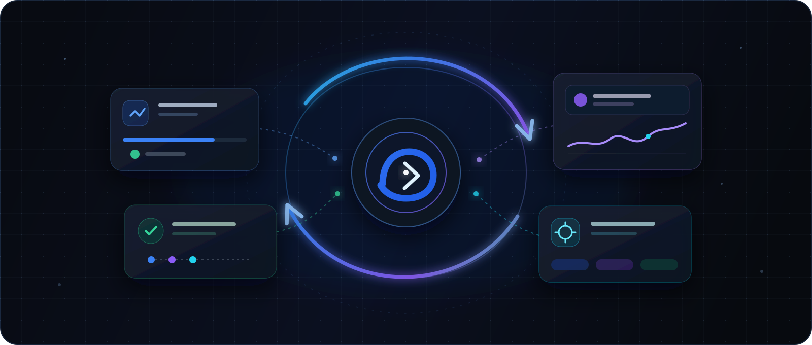
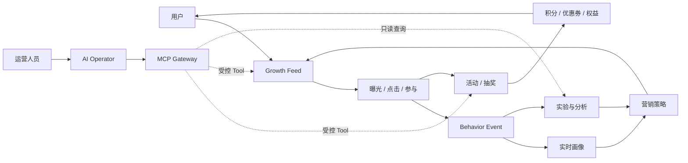

<p align="center">
  
</p>

<h1 align="center">GrowthOS-Go</h1>

<p align="center">
  <strong>AI 原生大营销与智能增长平台</strong><br />
  用真实需求推动数据库、领域模型和系统架构持续演进。
</p>

<p align="center">
  <a href="docs/README.md">文档中心</a> ·
  <a href="docs/course/README.md">96 节路线</a> ·
  <a href="docs/product/product-brief.md">产品定义</a> ·
  <a href="docs/frontend/frontend-architecture.md">前端架构</a> ·
  <a href="CONTRIBUTING.md">参与贡献</a>
</p>

<p align="center">
  
  
  
  
  
  
</p>

> [!IMPORTANT]
> GrowthOS-Go 正在按 96 节演进式路线持续建设。当前已完成第 1～11 节和第 14 节 React 前端框架；第 11 节只交付无外部依赖的 Gin 健康接口与进程生命周期。业务 API、业务表、Redis、RocketMQ、微服务、MCP Gateway 与 Agent 仍处于后续计划，不能把目标 SLO、仓库占位目录或前端 Mock 页面视为这些能力已经实现。

## 项目简介

GrowthOS-Go 面向电商、出行、金融、内容和游戏等高流量业务，目标是统一承载营销活动、抽奖、积分、优惠券、用户奖励、个性化 Feed、行为采集、用户画像、实验分析和 AI 自动运营。

它不是一次性堆出终态架构的演示项目，而是一套可以追踪设计理由的工程课程：

```text
需求出现 → 最小领域建模 → 设计当前所需数据 → 编码与联调
       → 新需求暴露问题 → Migration / 索引 / 冗余 → 重构与扩展
```

每个关键决策都要回答“为什么现在需要”，数据库、领域模型和部署拓扑不会在第一天被假装设计完整。

## 为什么做 GrowthOS

许多业务可以快速完成一次活动，却很难把能力沉淀为长期平台：活动规则重复建设、权益口径割裂、用户触达互相竞争、行为数据无法归因，高风险操作也缺少审批和审计。

GrowthOS 将这些问题组织成三层持续演进的能力：

| 层次 | 目标 | 核心能力 |
| --- | --- | --- |
| **Business** | 完成营销业务闭环 | 活动、抽奖、积分、优惠券、返利、权益 |
| **Growth** | 用反馈持续优化触达 | Feed、行为、画像、实验、漏斗、Ranking |
| **AI Native** | 让 AI 在受控边界内参与运营 | MCP Gateway、Tool、Agent、审批、审计 |

## 增长闭环



AI 不直接修改数据库，也不拥有超级权限。自然语言负责表达目标，结构化计划负责评审，业务 Tool 负责执行，权限、审批和审计负责控制风险。

## 设计原则

- **需求驱动演进：** 新组件必须对应已经出现或被证明的问题，技术清单不是验收清单。
- **模块化单体优先：** 第一版保持低运维复杂度，只有部署和组织边界被真实证明后才拆服务。
- **数据库也是课程主线：** 使用 SQL Migration、`sqlx` 和手写核心 SQL，保留每次结构演进的原因。
- **范式不是教条：** 核心事实重视一致性和流水，配置允许版本与 JSON，分析数据按查询模式设计宽表。
- **事实与派生数据分离：** MySQL 承载业务事实，缓存、搜索和分析模型可以重建。
- **文档与代码同批交付：** 产品、ADR、API、QA 和运维文档必须跟随实现更新，并通过漂移检查。
- **只先完成 Go 版本：** Java 版在 Go 版形成稳定业务 Specification 后单独规划，不维护两套半成品。

## 当前可用内容

### Go HTTP 运行时

第 11 节已经建立基于 Go 1.26.6 与 Gin v1.12.0 的最小产品进程，提供不带业务依赖的 `GET /health`，并支持信号驱动的优雅关闭：

```bash
go run ./cmd/growth-api
curl -i http://127.0.0.1:8080/health
```

健康响应只证明当前进程和 HTTP handler 可用，不检查 MySQL、Redis、消息队列或业务模块，也不代表前端已经完成真实联调。

### React 前端框架

`web/` 已提供统一的用户端、运营后台、MCP 控制台和 AI Operator 页面框架，包含响应式布局、明暗主题、路由、集中 Mock 数据与基础可视化。当前主要用于确认产品信息架构与 UI 基线。

```bash
git clone git@github.com:Atingaii/GrowthOS-Go.git
cd GrowthOS-Go

corepack enable
make web-install
cd web && pnpm run dev
```

默认访问 `http://localhost:5173`。第 11 节已建立 Go 健康接口；React 页面仍使用 Mock 数据，第 15 节才完成首次真实前后端联调。

### 工程质量门禁

本地需要 Go 1.26.6+、Node.js 22+ 和 pnpm。Go 工具链基线及维护策略见 [ADR-0008](docs/decisions/ADR-0008-supported-go-toolchain-baseline.md)。运行统一检查：

```bash
make verify
```

该命令会执行：

- Go 格式检查与 `go test ./...`；
- 课程状态、章节 QA、API 台账、ADR 索引和 Markdown 链接检查；
- React/TypeScript 类型检查；
- Vite 生产构建。

## 技术路线

下表区分当前已经进入仓库的能力和未来按需求逐步接入的能力。

| 领域 | 当前基线 | 演进目标 |
| --- | --- | --- |
| 后端 | Go 1.26.6、Gin v1.12.0、`GET /health`、工程与文档检查工具 | 业务 API、gRPC + Protobuf、`sqlx`、OpenTelemetry |
| 前端 | React 19、TypeScript、Vite 8、Tailwind CSS、Zustand、Recharts | 用户端、运营端、MCP 与 AI Operator 真实联调 |
| 数据 | 尚未建立业务表 | MySQL、Redis、ClickHouse、OpenSearch |
| 消息与治理 | 尚未接入 | RocketMQ、Nacos、Sentinel-Go、任务补偿 |
| AI | 产品工作流与风险边界 | MCP、LLM Provider、Tool Calling、Agent、RAG、人工审批 |
| 交付 | 本地质量门禁 | Docker Compose、GitHub Actions、Kubernetes、可观测体系 |

> 技术路线代表计划，不代表当前仓库已经实现对应中间件。

## 课程路线

整个项目拆为 12 个阶段、96 节。完整标题和每节证据以 [`docs/course/status.csv`](docs/course/status.csv) 为唯一状态源。

| 阶段 | 章节 | 主题 | 状态 |
| --- | --- | --- | --- |
| 1 | 1～8 | 产品需求与系统分析 | 已完成 |
| 2 | 9～16 | Go + React 从零搭建 | 进行中：第 9、10、11、14 节完成 |
| 3 | 17～24 | 从两张表开始做抽奖 | 计划中 |
| 4 | 25～32 | 规则系统与营销活动 | 计划中 |
| 5 | 33～40 | 活动账户、订单与库存 | 计划中 |
| 6 | 41～48 | MQ、最终一致性与补偿 | 计划中 |
| 7 | 49～56 | 积分、优惠券、返利与权益中心 | 计划中 |
| 8 | 57～64 | Growth Feed 与用户行为 | 计划中 |
| 9 | 65～72 | Feed 推荐、实验与增长分析 | 计划中 |
| 10 | 73～80 | 模块化单体到分布式 | 计划中 |
| 11 | 81～88 | AI MCP Gateway | 计划中 |
| 12 | 89～96 | AI Agent、可观测、压测与上线 | 计划中 |

### 可部署里程碑

`M0` 到 `M7` 不等待最终章节才展示成果，每个里程碑都要求可启动、可操作、有测试并有文档证据。

```text
M0 工程联调 → M1 抽奖 MVP → M2 营销活动 MVP → M3 权益中心
           → M4 增长闭环 → M5 分布式平台 → M6 MCP Gateway → M7 生产验收
```

## 仓库结构

```text
GrowthOS-Go/
├── cmd/             # Go 可执行程序与项目工具
├── internal/        # 私有领域与基础设施模块，按章节逐步加入
├── pkg/             # 少量稳定的公共 Go 包
├── configs/         # 可版本化且不包含秘密的配置示例
├── migrations/      # 第 13 节开始使用的前向 SQL Migration
├── deploy/          # 随基础设施逐步加入的部署资源
├── scripts/         # 本地自动化脚本
├── docs/            # 产品、架构、ADR、API、QA 和课程事实源
└── web/             # React 用户端、运营端、MCP 与 AI Operator 框架
```

工程目录也会随着复杂度演进，不会为了模拟最终微服务形态提前创建空服务。

## 文档地图

| 文档 | 说明 |
| --- | --- |
| [文档中心](docs/README.md) | 项目事实的统一入口 |
| [产品简述](docs/product/product-brief.md) | 产品定位、范围、目标用户和成功信号 |
| [用户增长旅程](docs/product/user-growth-journey-v1.md) | 从触达到转化和再次触达的完整体验 |
| [运营人员工作流](docs/product/operator-workflow-v1.md) | 配置、审批、发布、止损和复盘 |
| [AI Operator 工作流](docs/product/ai-operator-workflow-v1.md) | AI 计划、Tool、审批、失败与审计边界 |
| [领域事件地图](docs/product/domain-event-map-v1.md) | 命令、事件、策略、失败和补偿 |
| [限界上下文地图](docs/product/bounded-context-map-v1.md) | 业务语言、事实所有权和上下文协作 |
| [非功能需求基线](docs/product/non-functional-requirements-v1.md) | 容量、延迟、一致性、恢复与降级目标 |
| [前端架构](docs/frontend/frontend-architecture.md) | 页面边界、路由、Mock 和运行方式 |
| [章节 API 台账](docs/api/lessons/README.md) | 每节新增或调整的前端调用契约 |
| [ADR 索引](docs/decisions/README.md) | 长期架构决策及其取舍 |
| [QA 索引](docs/qa/README.md) | 验收证据、已知风险与未覆盖项 |

仓库 `docs/` 是唯一事实源；个人 Obsidian 目录只接收镜像同步，不回写、不提交：

```bash
make docs-sync VAULT=/absolute/path/to/growthOS
```

## 参与贡献

欢迎围绕产品分析、Go 工程、数据库演进、React、测试和文档提出改进。提交前请阅读 [`CONTRIBUTING.md`](CONTRIBUTING.md)，并确保：

1. 变更范围聚焦，代码、文档、测试和 Migration 描述同一个事实；
2. 长期技术决策新增或替代 ADR；
3. 行为变化同步更新 API、QA 和相关课程文档；
4. `make verify` 完整通过；
5. API Key、密码和环境专属配置不进入仓库。

## 项目状态与许可

GrowthOS-Go 当前处于公开建设阶段，接口、目录和领域边界仍会按课程证据演进。仓库尚未发布正式开源许可证；在许可证文件加入前，代码的复制、分发和衍生使用不自动获得授权。

<p align="center">
  <strong>Build the system by understanding why it must evolve.</strong>
</p>
