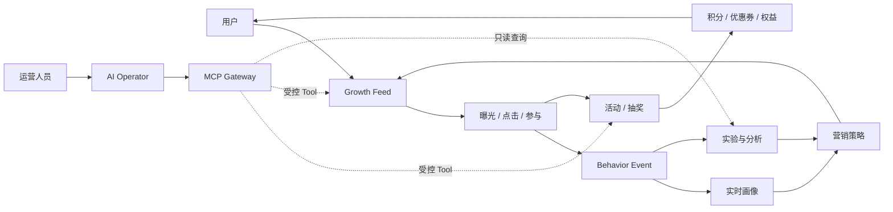

<p align="center">
  
</p>

<h1 align="center">GrowthOS-Go</h1>

<p align="center">
  <strong>AI 原生大营销与智能增长平台</strong><br />
  用真实需求推动数据库、领域模型和系统架构持续演进。
</p>

<p align="center">
  <a href="docs/README.md">文档中心</a> ·
  <a href="docs/course/README.md">101 节路线</a> ·
  <a href="docs/product/product-brief.md">产品定义</a> ·
  <a href="docs/configuration.md">配置参考</a> ·
  <a href="docs/frontend/frontend-architecture.md">前端架构</a> ·
  <a href="CONTRIBUTING.md">参与贡献</a>
</p>

<p align="center">
  
  
  
  
  
  
</p>

> [!IMPORTANT]
> GrowthOS-Go 正在按 101 节演进式路线持续建设。当前已完成第 1～24 节，共 24 节：M0 Compose 工程基线与 M1 Strategy 缓存本地基线均已验收。第 17～23 节依次建立 Lottery 领域模型、两张 MySQL 表、Strategy 仓储、无偏加权选择、development/test ephemeral API、真实 React 消费者与规则所有权停止线；第 24 节再以 MySQL 为唯一事实源，为完整 Strategy 聚合增加可选 Redis cache-aside、严格版本化 codec、TTL/jitter、同 key 回源合并、故障降级和最小 ACL。公开 HTTP/前端契约不变。当前仍没有正式 Draw/Result、登录认证、RBAC/对象级授权、幂等、参与资格、库存或发奖；其余用户、Admin、MCP 与 Agent 工作台仍是明确 Mock/本地交互。缓存命中和可见的 ephemeral selection 都不等于在线抽奖闭环。

## 项目简介

GrowthOS-Go 面向电商、出行、金融、内容和游戏等高流量业务，目标是统一承载营销活动、抽奖、积分、优惠券、用户奖励、个性化 Feed、行为采集、用户画像、实验分析和 AI 自动运营。

它不是一次性堆出终态架构的演示项目，而是一套可以追踪设计理由的工程课程：

```text
需求出现 → 最小领域建模 → 设计当前所需数据 → 编码与联调
       → 新需求暴露问题 → Migration / 索引 / 冗余 → 重构与扩展
```

每个关键决策都要回答“为什么现在需要”，数据库、领域模型和部署拓扑不会在第一天被假装设计完整。

## 为什么做 GrowthOS

许多业务可以快速完成一次活动，却很难把能力沉淀为长期平台：活动规则重复建设、权益口径割裂、用户触达互相竞争、行为数据无法归因，高风险操作也缺少审批和审计。

GrowthOS 将这些问题组织成三层持续演进的能力：

| 层次 | 目标 | 核心能力 |
| --- | --- | --- |
| **Business** | 完成营销业务闭环 | 活动、抽奖、积分、优惠券、返利、权益 |
| **Growth** | 用反馈持续优化触达 | Feed、行为、画像、实验、漏斗、Ranking |
| **AI Native** | 让 AI 在受控边界内参与运营 | MCP Gateway、Tool、Agent、审批、审计 |

## 增长闭环



AI 不直接修改数据库，也不拥有超级权限。自然语言负责表达目标，结构化计划负责评审，业务 Tool 负责执行，权限、审批和审计负责控制风险。

## 设计原则

- **需求驱动演进：** 新组件必须对应已经出现或被证明的问题，技术清单不是验收清单。
- **模块化单体优先：** 第一版保持低运维复杂度，只有部署和组织边界被真实证明后才拆服务。
- **数据库也是课程主线：** 数据库接入后使用 SQL Migration、`sqlx` 和手写核心 SQL，保留每次结构演进的原因。
- **范式不是教条：** 核心事实重视一致性和流水，配置允许版本与 JSON，分析数据按查询模式设计宽表。
- **事实与派生数据分离：** 目标形态中由 MySQL 承载业务事实，缓存、搜索和分析模型可以重建。
- **文档与代码同批交付：** 产品、设计推导、ADR、API、QA、面试和运维文档必须跟随实现更新，并通过漂移检查。
- **只先完成 Go 版本：** Java 版在 Go 版形成稳定业务 Specification 后单独规划，不维护两套半成品。

## 当前可用内容

### Go HTTP 与 MySQL 运行时

第 11～13 节已经建立基于 Go 1.26.6 与 Gin v1.12.0 的产品进程：提供 `GET /health` liveness、`GET /ready` MySQL readiness、信号驱动的优雅关闭、`GROWTHOS_` 类型化配置、`slog`、`X-Request-ID`、统一错误和有界 `sqlx` 连接池。

从第 13 节起，公开默认值不再等于完整可启动配置。管理员需要先创建权限隔离的 `growthos_app` / `growthos_migrator` 账号，并通过未跟踪环境或 Secret 注入对应密码；示例文件有意不包含密码。注入 API Secret 后运行：

```bash
make api-run
```

在另一个终端核查两个探针和统一错误：

```bash
curl -i -H 'X-Request-ID: readme-health' http://127.0.0.1:8080/health
curl -i -H 'X-Request-ID: readme-ready' http://127.0.0.1:8080/ready
curl -i http://127.0.0.1:8080/missing
curl -i -X POST http://127.0.0.1:8080/ready
```

`/health` 不查询外部依赖，只证明进程和 handler 可响应；API 启动前已经执行一次有界 MySQL Ping，运行中 `/ready` 每次有界 Ping，失败返回 503 `dependency_unavailable`。这让平台能区分“进程崩溃”和“依赖故障”。

Migration 使用独立账号、配置和命令，不在 API 启动时自动执行：

```bash
make db-status
make db-migrate
```

当前产品迁移 latest 为 `2`：`000001_create_lottery_strategy.up.sql` 与 `000002_create_lottery_strategy_award.up.sql` 分别创建聚合根表和候选表；已应用环境的 `status` 应为 `clean` 且 `version=latest=2`，重复执行 `up` 应为 `no_change`。完整变量见[配置参考](docs/configuration.md)，探针后端契约见[第 13 节 API 记录](docs/api/lessons/lesson-13.md)，第 19 节“仓储已实现但仍无 HTTP 业务接口”的边界见[章节 API 台账](docs/api/lessons/README.md)，发布与故障处置见 [MySQL Migration 运维手册](docs/runbooks/mysql-migrations.md)。

### Lottery 领域模型、业务表、Strategy 仓储、加权选择与临时 API

第 17 节在 `internal/lottery/domain` 建立第一组业务对象：`Strategy` 聚合拥有至少一个 `Award`，拒绝零 ID、非法名称、零权重、未知 Outcome、重复 AwardID 与总权重溢出；候选使用正整数相对权重，合法未中奖由显式 `no_reward` Award 表达，slice 所有权与 AwardID 规范顺序由聚合维护。

```bash
go test ./internal/lottery/domain
go test -race ./internal/lottery/domain
```

第 18 节将这组当前持久化事实拆为 `lottery_strategy` 与 `lottery_strategy_award` 两张 InnoDB 表，以 `(strategy_id, award_id)` 复合主键、外键 `RESTRICT`、正 ID/权重和封闭 outcome 约束保护单行与关联完整性。数据库名称约束 `*_name_basic` 只拒绝空字符串和首尾 ASCII U+0020 空格，不等价于 Go 的完整 Unicode/控制字符契约；行级 `updated_at` 也只是各自行元数据，不是 Strategy 聚合版本。

第 19 节在 `internal/lottery/application` 定义调用方拥有的 `StrategyCreator` / `StrategyReader` 窄端口，在 `internal/lottery/adapter/mysqlrepo` 实现手写 SQL：Create 在一个事务中先写根再按 AwardID 稳定顺序写全体 Award；FindByID 在同一个只读 `REPEATABLE READ` 快照内执行根/子两次查询，事务结束后通过 `RestoreAward` / `RestoreStrategy` 恢复并重新验证聚合。不存在、重复、坏快照、暂态 1205/1213、普通仓储故障和写提交结果未知都有独立语义；adapter 不自行重试，也不关闭调用方拥有的连接池。

第 20 节在 `internal/lottery/domain` 增加 consumer-owned `BoundedRandomSource` 与 `WeightedSelector`：多候选 Strategy 从 `[0,totalWeight)` 获取均匀整数位置，再用无加法溢出的减法桶线性扫描选择 Award；单候选确定性短路，`no_reward` 仍是成功结果。`internal/lottery/adapter/randomsource` 使用标准库 `crypto/rand.Int`，支持 `math.MaxUint64`、拒绝取模偏差，并区分未配置、熵失败、越界 source 与内部不变量错误。纯 mapper 的本机 benchmark 为 0 alloc，但不能外推为产品吞吐。

第 21 节新增 `EphemeralSelectionService` 和 Lottery HTTP adapter，并在 `growth-api` composition root 中共享既有 MySQL pool、只读 Repository 与 `CryptoSource`。启用时可调用：

```bash
curl --request POST \
  --header 'X-GrowthOS-Demo-Mode: ephemeral-selection' \
  http://127.0.0.1:8088/api/v1/lottery/strategies/1/ephemeral-selections
```

完整 `uint64` ID 在 path 和 JSON 中使用规范十进制字符串；成功与应用 JSON 错误均为 `no-store` 并可用 `X-Request-ID` 关联。路由默认关闭，只允许 development/test 显式打开；它读取 Strategy 快照并返回配置内 Award，不创建 Draw，也不支持幂等重放。当前 Compose 运行身份已进一步收敛为两张业务表 `SELECT`，不能 INSERT、UPDATE、DELETE、执行 DDL 或访问 `schema_migrations`；需要写 fixture 的第 19 节隔离集成测试继续使用专门的测试身份与可丢弃 schema，而不是扩宽运行账号。

边缘入口限制本地 Host、请求 framing、16 KiB 资源上限和 timeout。非法 Host 的 421 是 Nginx server-level 非 JSON 响应；经 API location 识别的空 chunked 和非空 Trailer 声明返回 JSON 400，HTTP parser 更早拒绝的不支持 Transfer-Encoding 仍可能是非 JSON。真实隔离验收共发起 64 个多 Award 请求、最大并行度 16；这只是并发正确性证据，不是 64 并发、64 RPS 或生产压测。

第 21 节学习资料：[课程正文](docs/course/part-03/lesson-21-lottery-api.md)、[API 契约](docs/api/lessons/lesson-21.md)、[QA 证据](docs/qa/lessons/lesson-21.md)、[第一性原理手记](docs/design-thinking/lessons/lesson-21.md)、[面试问答](docs/interview/lessons/lesson-21.md)与 [ADR-0018](docs/decisions/ADR-0018-ephemeral-lottery-selection-api.md)。

第 22 节为这条后端能力增加真实 React 消费者：`lotteryApi` 校验完整 `uint64` 十进制 string 和响应 DTO，`useEphemeralLotterySelection` 管理 pending 抑制、取消与旧响应隔离，页面明确区分 `reward`、`no_reward`、HTTP 拒绝、网关/网络失败、timeout、取消和契约漂移。它没有增加 Go 路由，也没有把临时选择升级成正式 Draw。学习资料见[课程正文](docs/course/part-03/lesson-22-react-lottery-page.md)、[API 契约](docs/api/lessons/lesson-22.md)、[QA 证据](docs/qa/lessons/lesson-22.md)、[第一性原理手记](docs/design-thinking/lessons/lesson-22.md)和[面试问答](docs/interview/lessons/lesson-22.md)。

第 23 节把“活动有效、新用户且有次数、风险允许、按会员路由、奖励可分配、仍可能未中奖”拆成可追踪需求，明确业务资格拒绝、合法 `no_reward`、资源不可用、技术失败/结果未知和授权拒绝不能互相冒充。现阶段没有足够真实消费者支撑通用 `Rule`、规则树或 DSL，因此本节只交付[规则需求基线](docs/product/lottery-rule-requirements-v1.md)、[ADR-0019](docs/decisions/ADR-0019-lottery-rule-ownership-and-evaluation-boundaries.md)、[课程](docs/course/part-03/lesson-23-lottery-strategy-rule-requirements.md)、[API 零变化记录](docs/api/lessons/lesson-23.md)、[QA](docs/qa/lessons/lesson-23.md)、[设计手记](docs/design-thinking/lessons/lesson-23.md)和[面试问答](docs/interview/lessons/lesson-23.md)。

第 24 节只缓存可由 MySQL 和领域构造器完整重建的 Strategy 读取投影，不缓存资格、权限、库存、随机选择或 Draw/Result。cache hit 仍需严格解码与领域恢复；miss、Redis 错误和 poison value 在有界预算内回源，not-found 不做负缓存。Compose 只允许 API/Redis 进入 internal cache 网络；业务 Redis 用户可执行无 key 的 `PING`，并只可对版本化前缀执行 `GETRANGE/SET/DEL`，默认用户、扫描、管理与 Pub/Sub 均关闭。完整证据见[课程](docs/course/part-03/lesson-24-redis-strategy-cache.md)、[ADR-0020](docs/decisions/ADR-0020-lottery-strategy-cache-aside.md)、[API](docs/api/lessons/lesson-24.md)、[QA](docs/qa/lessons/lesson-24.md)、[设计手记](docs/design-thinking/lessons/lesson-24.md)、[面试问答](docs/interview/lessons/lesson-24.md)和[运维手册](docs/runbooks/redis-strategy-cache.md)。

### React 前端框架

`web/` 已提供统一的用户端、运营后台、MCP 控制台和 AI Operator 页面框架。第 22 节以共享 `WorkspaceShell` 收敛桌面侧栏、移动抽屉、顶栏、搜索、主题、通知样例、内容宽度和可访问交互，并重构为高密度、扁平的工作台信息架构。真实前端链路目前只有两类：`/system/status` 消费 Go 的 `GET /health` 与 `GET /ready`；`/lottery` 通过 `lotteryApi`、运行时 decoder 和请求状态 Hook 消费 development/test ephemeral selection API。活动、Feed、积分、优惠券、个人资料、Admin、MCP 与 Agent 页面仍使用带时间标签的 Mock 快照或浏览器内本地状态，不是实时后端数据。工作台分组也不是身份或权限系统；当前没有登录认证、RBAC、租户/对象级数据范围或服务端授权强制。

```bash
git clone git@github.com:Atingaii/GrowthOS-Go.git
cd GrowthOS-Go

corepack enable
make web-install
cd web && pnpm run dev
```

开发服务器默认访问 `http://127.0.0.1:5173`，生产构建预览默认访问 `http://127.0.0.1:4173`。Vite 将精确匹配的 `/health`、`/ready` 与 `/api` 路径代理到默认的 `http://127.0.0.1:8080`；系统状态页因此保持浏览器同源请求。代理目标与校验规则见[配置参考](docs/configuration.md)。

### Docker Compose M0 开发环境

第 24 节仍沿用不会占用宿主机 MySQL/Redis 端口的本地路径。需要 Docker Desktop 与 Compose 插件；仓库只发布 Web 的回环端口 `127.0.0.1:8088`，API、MySQL、Redis、Migration 与授权作业不发布宿主机端口。首次启动会在被 Git 忽略的目录生成本地 Secret 文件：

```bash
make compose-up
make compose-smoke
```

访问 `http://127.0.0.1:8088/system/status` 查看真实系统状态。启动门仍为 `mysql → migrate → mysql-grants → api`；Redis 独立启动，不进入 API readiness。`compose-smoke` 会检查四个常驻服务、两个 one-shot、latest 2、MySQL SELECT-only、Redis internal 网络/Secret/ACL/内存策略、探针、HTTP 契约和端口隔离。第 24 节真实成功/失败/cache/fault 链路使用会自行验证所有权并清理的独立环境：

```bash
make compose-lottery-api-acceptance
```

该 acceptance 不写长期 `growthos` 数据；它验证 ACL、poison 修复、Redis/MySQL warm/cold 故障恢复与三组 50 RPS×10s M1 路径。三组均 500/500 成功，warm-cache 的 MySQL prepared execute 为 0，cache-disabled/Redis-down 均为 1000；这不是正式 Draw SLO 或生产容量。完整 M0 门禁仍执行健康探针 100 RPS×5 分钟以及 readiness 20 RPS×30 秒：

```bash
make compose-m0
```

停止容器但保留 MySQL named volume 使用 `make compose-down`。只有确认需要删除本项目 Compose 数据时，才按 [Docker Compose 运维手册](docs/runbooks/local-compose.md)中的显式确认口令执行 `compose-reset`；保留数据卷时也必须保留与之匹配的本地 Secret 文件。

### 工程质量门禁

本地需要 Go 1.26.6+、Node.js 22.22.2+ 和 pnpm 10.13.1。Go 工具链基线及维护策略见 [ADR-0008](docs/decisions/ADR-0008-supported-go-toolchain-baseline.md)。运行统一检查：

```bash
make verify
```

该命令会执行：

- Go 格式检查与 `go test ./...`；
- 课程状态、章节 QA、API 台账、ADR 索引和 Markdown 链接检查；
- Vitest 前端单元/组件测试；
- React/TypeScript 类型检查；
- Vite 生产构建。

## 技术路线

下表区分当前已经进入仓库的能力和未来按需求逐步接入的能力。

| 领域 | 当前基线 | 演进目标 |
| --- | --- | --- |
| 后端 | Go 1.26.6、Gin v1.12.0、类型化配置、`slog`、请求关联、统一错误、健康/readiness、`sqlx` 与可选 Redis pool；Lottery Strategy/Award、仓储、cache-aside、无偏 Selector、crypto adapter 和 development/test ephemeral API | 正式 Draw API、认证/授权、幂等、gRPC + Protobuf、OpenTelemetry |
| 前端 | React 19、TypeScript、Vite 8、Tailwind CSS、Zustand、Recharts、共享 `WorkspaceShell`、同源 Fetch Client 与运行时解码；系统状态页和 ephemeral Lottery 页面已真实联调；第 24 节缓存不扩张浏览器契约 | 第 31～35 节在首个真实运营后台前依次建立公共访问控制模型、会话认证、服务端强制、前端权限感知和越权验收 |
| 数据 | MySQL 8.4、API/Migrator 身份隔离、latest 2 前向 Migration、两张 Lottery 表、事务创建/RR 快照；运行身份仅两表 `SELECT`；Redis 只保存版本化 Strategy 投影，48 MiB `allkeys-lru`、无持久化、最小 ACL | Draw/Result、库存与发奖事实、更新/聚合版本及精准缓存失效、ClickHouse、OpenSearch |
| 消息与治理 | 尚未接入 | RocketMQ、Nacos、Sentinel-Go、任务补偿 |
| AI | 产品工作流与风险边界 | MCP、LLM Provider、Tool Calling、Agent、RAG、人工审批 |
| 交付 | 本地质量门禁、隔离 Compose 开发栈、smoke、故障演练与 M0 定速负载门禁 | GitHub Actions、Kubernetes、可观测体系 |

> 技术路线代表计划，不代表当前仓库已经实现对应中间件。

## 课程路线

整个项目拆为 12 个阶段、101 节。前两部分与第三部分仍保持原来的八节节奏；第四部分为承载公共访问控制能力扩展为 13 节，后续部分继续按八节推进。完整标题和每节证据以 [`docs/course/status.csv`](docs/course/status.csv) 为唯一状态源。

| 阶段 | 章节 | 主题 | 状态 |
| --- | --- | --- | --- |
| 1 | 1～8 | 产品需求与系统分析 | 已完成 |
| 2 | 9～16 | Go + React 从零搭建 | 已完成：M0 Compose 工程联调已验收 |
| 3 | 17～24 | 从两张表开始做抽奖 | 已完成：Strategy/Award、两表、仓储、选择、API/React、规则边界与 Redis 读取投影/M1 均已验收 |
| 4 | 25～37 | 规则系统、公共访问控制与营销活动 | 计划中：第 31～35 节先形成跨工作台统一访问控制，再交付真实运营后台 |
| 5 | 38～45 | 活动账户、订单与库存 | 计划中 |
| 6 | 46～53 | MQ、最终一致性与补偿 | 计划中 |
| 7 | 54～61 | 积分、优惠券、返利与权益中心 | 计划中 |
| 8 | 62～69 | Growth Feed 与用户行为 | 计划中 |
| 9 | 70～77 | Feed 推荐、实验与增长分析 | 计划中 |
| 10 | 78～85 | 模块化单体到分布式 | 计划中 |
| 11 | 86～93 | AI MCP Gateway | 计划中 |
| 12 | 94～101 | AI Agent、可观测、压测与上线 | 计划中 |

> 访问控制不是看到 UI 后临时补一组菜单判断，而是所有操作者和工作台共享的平台能力。路线保留第 23～30 节的 Lottery 规则与 Activity 建模，让主体、资源、动作和数据范围先有真实业务对象；随后在第 31～35 节依次完成公共权限模型与威胁边界、真实会话认证、服务端 RBAC 强制执行、前端按权限裁剪和越权端到端验收，并在第 36 节首个真实运营后台复用这套能力。当前四类工作台仍只是信息架构分区，没有认证或授权证据。

### 可部署里程碑

`M0` 到 `M7` 不等待最终章节才展示成果，每个里程碑都要求可启动、可操作、有测试并有文档证据。

```text
M0 工程联调 → M1 Lottery 读取/临时选择基线 → M2 营销活动 MVP
           → M3 权益中心 → M4 增长闭环 → M5 分布式平台
           → M6 MCP Gateway → M7 生产验收
```

## 仓库结构

```text
GrowthOS-Go/
├── cmd/             # Go 可执行程序与项目工具
├── internal/        # 私有领域与基础设施模块；已含 Lottery 聚合、仓储、选择用例与 HTTP adapter
├── pkg/             # 少量稳定的公共 Go 包
├── configs/         # 可版本化且不包含秘密的配置示例
├── migrations/      # 嵌入式前向 SQL Migration；000001/000002 创建首组 Lottery 业务表
├── deploy/          # Compose 拓扑、容器镜像入口、网关配置与本地秘密挂载约定
├── scripts/         # Secret 生成、Compose smoke、隔离 Lottery API acceptance 与其他自动化
├── docs/            # 产品、架构、ADR、API、QA、设计推导、面试与课程事实源
└── web/             # React 用户端、运营端、MCP 与 AI Operator 框架
```

工程目录也会随着复杂度演进，不会为了模拟最终微服务形态提前创建空服务。

## 文档地图

| 文档 | 说明 |
| --- | --- |
| [文档中心](docs/README.md) | 项目事实的统一入口 |
| [产品简述](docs/product/product-brief.md) | 产品定位、范围、目标用户和成功信号 |
| [用户增长旅程](docs/product/user-growth-journey-v1.md) | 从触达到转化和再次触达的完整体验 |
| [运营人员工作流](docs/product/operator-workflow-v1.md) | 配置、审批、发布、止损和复盘 |
| [AI Operator 工作流](docs/product/ai-operator-workflow-v1.md) | AI 计划、Tool、审批、失败与审计边界 |
| [领域事件地图](docs/product/domain-event-map-v1.md) | 命令、事件、策略、失败和补偿 |
| [限界上下文地图](docs/product/bounded-context-map-v1.md) | 业务语言、事实所有权和上下文协作 |
| [Lottery 规则需求基线](docs/product/lottery-rule-requirements-v1.md) | 规则阶段、权威事实、失败语义、版本边界与渐进实现停止线 |
| [非功能需求基线](docs/product/non-functional-requirements-v1.md) | 容量、延迟、一致性、恢复与降级目标 |
| [前端架构](docs/frontend/frontend-architecture.md) | 页面边界、路由、Mock 和运行方式 |
| [运行配置](docs/configuration.md) | `GROWTHOS_` 变量、默认值、校验和秘密边界 |
| [MySQL Migration 运维手册](docs/runbooks/mysql-migrations.md) | 状态检查、前向发布、故障停止条件与清理 |
| [Docker Compose 运维手册](docs/runbooks/local-compose.md) | 本地 Secret、启停、M0 验收、故障定位与数据重置 |
| [章节 API 台账](docs/api/lessons/README.md) | 每节新增或调整的前端调用契约 |
| [第一性原理设计手记](docs/design-thinking/README.md) | 每章的事实、推导链、备选矩阵、失败模型与重决策条件 |
| [章节面试问答](docs/interview/README.md) | 每章核心问题、追问、项目证据与选型边界 |
| [ADR 索引](docs/decisions/README.md) | 长期架构决策及其取舍 |
| [QA 索引](docs/qa/README.md) | 验收证据、已知风险与未覆盖项 |

仓库 `docs/` 是唯一事实源；个人 Obsidian 目录只接收镜像同步，不回写、不提交：

```bash
make docs-sync VAULT=/absolute/path/to/growthOS
```

## 参与贡献

欢迎围绕产品分析、Go 工程、数据库演进、React、测试和文档提出改进。提交前请阅读 [`CONTRIBUTING.md`](CONTRIBUTING.md)，并确保：

1. 变更范围聚焦，代码、文档、测试和 Migration 描述同一个事实；
2. 长期技术决策新增或替代 ADR；
3. 行为变化同步更新 API、QA、设计手记、面试问答和相关课程文档；
4. `make verify` 完整通过；
5. API Key、密码和环境专属配置不进入仓库。

## 项目状态与许可

GrowthOS-Go 当前处于公开建设阶段，接口、目录和领域边界仍会按课程证据演进。仓库尚未发布正式开源许可证；在许可证文件加入前，代码的复制、分发和衍生使用不自动获得授权。

<p align="center">
  <strong>Build the system by understanding why it must evolve.</strong>
</p>
