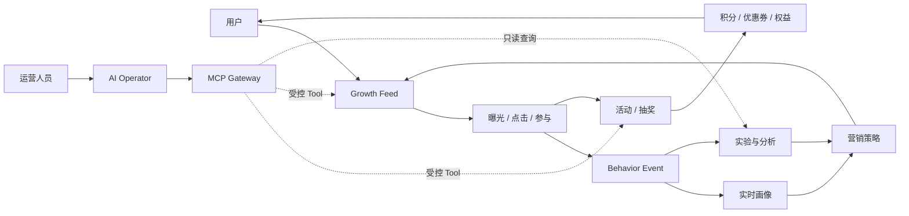

<p align="center">
  
</p>

<h1 align="center">GrowthOS-Go</h1>

<p align="center">
  <strong>AI 原生大营销与智能增长平台</strong><br />
  用真实需求推动数据库、领域模型和系统架构持续演进。
</p>

<p align="center">
  <a href="docs/README.md">文档中心</a> ·
  <a href="docs/course/README.md">101 节路线</a> ·
  <a href="docs/product/product-brief.md">产品定义</a> ·
  <a href="docs/configuration.md">配置参考</a> ·
  <a href="docs/frontend/frontend-architecture.md">前端架构</a> ·
  <a href="CONTRIBUTING.md">参与贡献</a>
</p>

<p align="center">
  
  
  
  
  
  
</p>

> [!IMPORTANT]
> GrowthOS-Go 正在按 101 节演进式路线持续建设。当前已完成并验收第 1～31 节，共 31 节；第 32 节“真实会话认证”已有可运行候选，独立 disposable MySQL 8.4.11 与 development HTTP wire 两项官方门禁已实际通过，最终全仓门禁、远端 ref 对齐与冻结 tip 仍待完成。候选以 Identity-owned account/session/throttle、Argon2id、HttpOnly Cookie、Origin/CSRF 和三方法 Session API 把 credential 转成 trusted human Principal，React 也提供真实 `/login` 与 `/session`。这仍不等于 RBAC：业务、Admin、MCP、Agent 路由尚未由第 33 节服务端强制，导航/操作尚未由第 34 节裁剪，第 35 节越权 E2E 也未完成。

## 项目简介

GrowthOS-Go 面向电商、出行、金融、内容和游戏等高流量业务，目标是统一承载营销活动、抽奖、积分、优惠券、用户奖励、个性化 Feed、行为采集、用户画像、实验分析和 AI 自动运营。

它不是一次性堆出终态架构的演示项目，而是一套可以追踪设计理由的工程课程：

```text
需求出现 → 最小领域建模 → 设计当前所需数据 → 编码与联调
       → 新需求暴露问题 → Migration / 索引 / 冗余 → 重构与扩展
```

每个关键决策都要回答“为什么现在需要”，数据库、领域模型和部署拓扑不会在第一天被假装设计完整。

## 为什么做 GrowthOS

许多业务可以快速完成一次活动，却很难把能力沉淀为长期平台：活动规则重复建设、权益口径割裂、用户触达互相竞争、行为数据无法归因，高风险操作也缺少审批和审计。

GrowthOS 将这些问题组织成三层持续演进的能力：

| 层次 | 目标 | 核心能力 |
| --- | --- | --- |
| **Business** | 完成营销业务闭环 | 活动、抽奖、积分、优惠券、返利、权益 |
| **Growth** | 用反馈持续优化触达 | Feed、行为、画像、实验、漏斗、Ranking |
| **AI Native** | 让 AI 在受控边界内参与运营 | MCP Gateway、Tool、Agent、审批、审计 |

## 增长闭环



AI 不直接修改数据库，也不拥有超级权限。自然语言负责表达目标，结构化计划负责评审，业务 Tool 负责执行，权限、审批和审计负责控制风险。

## 设计原则

- **需求驱动演进：** 新组件必须对应已经出现或被证明的问题，技术清单不是验收清单。
- **模块化单体优先：** 第一版保持低运维复杂度，只有部署和组织边界被真实证明后才拆服务。
- **数据库也是课程主线：** 数据库接入后使用 SQL Migration、`sqlx` 和手写核心 SQL，保留每次结构演进的原因。
- **范式不是教条：** 核心事实重视一致性和流水，配置允许版本与 JSON，分析数据按查询模式设计宽表。
- **事实与派生数据分离：** 目标形态中由 MySQL 承载业务事实，缓存、搜索和分析模型可以重建。
- **文档与代码同批交付：** 产品、设计推导、ADR、API、QA、面试和运维文档必须跟随实现更新，并通过漂移检查。
- **只先完成 Go 版本：** Java 版在 Go 版形成稳定业务 Specification 后单独规划，不维护两套半成品。

## 当前可用内容

### Go HTTP 与 MySQL 运行时

第 11～13 节已经建立基于 Go 1.26.6 与 Gin v1.12.0 的产品进程；第 32 节候选进一步让它同时拥有互不别名的 business 与 Identity `sqlx` pool。进程提供 `GET /health` liveness、`GET /ready` 双 MySQL authority readiness、信号驱动的优雅关闭、`GROWTHOS_` 类型化配置、`slog`、`X-Request-ID` 和统一错误。

从第 13 节起，公开默认值不再等于完整可启动配置。管理员需要使用隔离的 `growthos_app`、`growthos_identity`、`growthos_identity_provisioner` 与 `growthos_migrator` 账号，并通过未跟踪环境或 Secret 注入各自密码和 Identity protocol keys；示例文件有意不包含秘密。注入 API Secret 后运行：

```bash
make api-run
```

在另一个终端核查两个探针和统一错误：

```bash
curl -i -H 'X-Request-ID: readme-health' http://127.0.0.1:8080/health
curl -i -H 'X-Request-ID: readme-ready' http://127.0.0.1:8080/ready
curl -i http://127.0.0.1:8080/missing
curl -i -X POST http://127.0.0.1:8080/ready
```

`/health` 不查询外部依赖，只证明进程和 handler 可响应；API 启动前分别打开并 Ping business/Identity pool，运行中 `/ready` 在共同响应预算内检查两个 authority，任一失败都返回 503 `dependency_unavailable`。这让平台能区分“进程崩溃”和“至少一个权威依赖故障”，但不泄露具体失败的数据库身份。

Migration 使用独立账号、配置和命令，不在 API 启动时自动执行：

```bash
make db-status
make db-migrate
```

当前源码内嵌 Migration latest 为 `14`：历史 `000001`～`000011` 原样保留；`000012` 创建 workforce account，`000013` 创建 digest-only server-side session，`000014` 创建 login/source 双维度 authentication throttle，总计十张既有业务表加三张 Identity 表。第 30 节一次性 MySQL 8.4.11 的 v5→v11 结构、数据哈希、dirty/restore、权限与旧长期栈证据仍是受保护的历史基线；第 32 节只在其后追加 schema。`growthos_app` 继续只读旧 Strategy/Award，`growthos_identity` 只访问三张 Identity 表，`growthos_identity_provisioner` 只可向 account 表 `INSERT`，DDL 仍只属于 migrator。完整变量见[配置参考](docs/configuration.md)，Migration 操作见 [MySQL Migration 运维手册](docs/runbooks/mysql-migrations.md)。

第 28 节还提供独立的真实 MySQL 引擎门禁：

```bash
make lesson28-mysql-acceptance
```

它使用一次性 `mysql:8.4.11`、随机回环端口、tmpfs 数据目录和任务专用身份，保留第 28 节 historical latest 5、旧两表与 graph 三表 Repository 证据；第 30 节另由 `make lesson30-mysql-acceptance` 完成 v5→v11、snapshot/Marketing Repository、最小权限与清理验收。两个门禁都不会连接或修改长期 `growthos` Compose 数据，隔离测试写能力也不能据此扩宽运行账号。

### Identity 真实会话认证候选

第 32 节在独立 `internal/identity` 上下文中实现本地 workforce provider。账号只能经受控 one-shot provisioner 创建；密码使用固定、严格解析的 Argon2id envelope，昂贵验证受进程级并发与等待预算约束。成功登录每次生成新的 256-bit opaque token，MySQL 只保存 SHA-256 digest；Session 同时受 idle/absolute expiry、账号状态、authentication epoch、显式 revoke 和并发上限约束。Redis 不保存或兜底 Session。

浏览器只调用同源单数资源：`POST /api/v1/session` 创建、`GET /api/v1/session` 解析、`DELETE /api/v1/session` 注销。原始 token 只进入 host-only、`HttpOnly`、`SameSite=Strict` Cookie；CSRF token 绑定 Session 并只保留在 React 组件内存，unsafe 请求还要通过 exact Origin/Fetch Metadata 检查。公开 DTO 只返回 authenticated、human Principal、到期时间与 CSRF，不返回 account、login name、Role、Scope、Permission、Policy 或 token digest。

这条实现仍处于章节验收候选。完整契约和操作边界见[产品基线](docs/product/identity-session-authentication-v1.md)、[API](docs/api/lessons/lesson-32.md)、[运维手册](docs/runbooks/identity-session-operations.md)、[课程](docs/course/part-04/lesson-32-real-session-authentication.md)、[QA](docs/qa/lessons/lesson-32.md)、[设计手记](docs/design-thinking/lessons/lesson-32.md)、[面试问答](docs/interview/lessons/lesson-32.md)与[设计 QA](design-qa.md)。独立 MySQL 与 development HTTP wire 两项官方门禁已经通过；最终全仓门禁、远端 ref 对齐和冻结 tip 完成前，仍不把第 32 节写成已完成。

### Lottery/Marketing 领域、十表源码结构与未装配发布切片

第 17 节在 `internal/lottery/domain` 建立第一组业务对象：`Strategy` 聚合拥有至少一个 `Award`，拒绝零 ID、非法名称、零权重、未知 Outcome、重复 AwardID 与总权重溢出；候选使用正整数相对权重，合法未中奖由显式 `no_reward` Award 表达，slice 所有权与 AwardID 规范顺序由聚合维护。

```bash
go test ./internal/lottery/domain
go test -race ./internal/lottery/domain
```

第 18 节将这组当前持久化事实拆为 `lottery_strategy` 与 `lottery_strategy_award` 两张 InnoDB 表，以 `(strategy_id, award_id)` 复合主键、外键 `RESTRICT`、正 ID/权重和封闭 outcome 约束保护单行与关联完整性。数据库名称约束 `*_name_basic` 只拒绝空字符串和首尾 ASCII U+0020 空格，不等价于 Go 的完整 Unicode/控制字符契约；行级 `updated_at` 也只是各自行元数据，不是 Strategy 聚合版本。

第 19 节在 `internal/lottery/application` 定义调用方拥有的 `StrategyCreator` / `StrategyReader` 窄端口，在 `internal/lottery/adapter/mysqlrepo` 实现手写 SQL：Create 在一个事务中先写根再按 AwardID 稳定顺序写全体 Award；FindByID 在同一个只读 `REPEATABLE READ` 快照内执行根/子两次查询，事务结束后通过 `RestoreAward` / `RestoreStrategy` 恢复并重新验证聚合。不存在、重复、坏快照、暂态 1205/1213、普通仓储故障和写提交结果未知都有独立语义；adapter 不自行重试，也不关闭调用方拥有的连接池。

第 20 节在 `internal/lottery/domain` 增加 consumer-owned `BoundedRandomSource` 与 `WeightedSelector`：多候选 Strategy 从 `[0,totalWeight)` 获取均匀整数位置，再用无加法溢出的减法桶线性扫描选择 Award；单候选确定性短路，`no_reward` 仍是成功结果。`internal/lottery/adapter/randomsource` 使用标准库 `crypto/rand.Int`，支持 `math.MaxUint64`、拒绝取模偏差，并区分未配置、熵失败、越界 source 与内部不变量错误。纯 mapper 的本机 benchmark 为 0 alloc，但不能外推为产品吞吐。

第 21 节新增 `EphemeralSelectionService` 和 Lottery HTTP adapter，并在 `growth-api` composition root 中共享既有 MySQL pool、只读 Repository 与 `CryptoSource`。启用时可调用：

```bash
curl --request POST \
  --header 'X-GrowthOS-Demo-Mode: ephemeral-selection' \
  http://127.0.0.1:8088/api/v1/lottery/strategies/1/ephemeral-selections
```

完整 `uint64` ID 在 path 和 JSON 中使用规范十进制字符串；成功与应用 JSON 错误均为 `no-store` 并可用 `X-Request-ID` 关联。路由默认关闭，只允许 development/test 显式打开；它读取 Strategy 快照并返回配置内 Award，不创建 Draw，也不支持幂等重放。当前 Compose 运行身份已进一步收敛为两张业务表 `SELECT`，不能 INSERT、UPDATE、DELETE、执行 DDL 或访问 `schema_migrations`；需要写 fixture 的第 19 节隔离集成测试继续使用专门的测试身份与可丢弃 schema，而不是扩宽运行账号。

边缘入口限制本地 Host、请求 framing、16 KiB 资源上限和 timeout。任意未接受 Host（包括 Session API）都会转入 `@misdirected_request`，返回 correlated、`no-store` 且带 canonical API security headers 的 JSON 421；经 API location 识别的空 chunked 和非空 Trailer 声明返回 JSON 400。只有 Nginx/HTTP parser 在进入这些命名/API location 之前更早拒绝的非法 framing，才可能不是 JSON。真实隔离验收共发起 64 个多 Award 请求、最大并行度 16；这只是并发正确性证据，不是 64 并发、64 RPS 或生产压测。

第 21 节学习资料：[课程正文](docs/course/part-03/lesson-21-lottery-api.md)、[API 契约](docs/api/lessons/lesson-21.md)、[QA 证据](docs/qa/lessons/lesson-21.md)、[第一性原理手记](docs/design-thinking/lessons/lesson-21.md)、[面试问答](docs/interview/lessons/lesson-21.md)与 [ADR-0018](docs/decisions/ADR-0018-ephemeral-lottery-selection-api.md)。

第 22 节为这条后端能力增加真实 React 消费者：`lotteryApi` 校验完整 `uint64` 十进制 string 和响应 DTO，`useEphemeralLotterySelection` 管理 pending 抑制、取消与旧响应隔离，页面明确区分 `reward`、`no_reward`、HTTP 拒绝、网关/网络失败、timeout、取消和契约漂移。它没有增加 Go 路由，也没有把临时选择升级成正式 Draw。学习资料见[课程正文](docs/course/part-03/lesson-22-react-lottery-page.md)、[API 契约](docs/api/lessons/lesson-22.md)、[QA 证据](docs/qa/lessons/lesson-22.md)、[第一性原理手记](docs/design-thinking/lessons/lesson-22.md)和[面试问答](docs/interview/lessons/lesson-22.md)。

第 23 节把“活动有效、新用户且有次数、风险允许、按会员路由、奖励可分配、仍可能未中奖”拆成可追踪需求，明确业务资格拒绝、合法 `no_reward`、资源不可用、技术失败/结果未知和授权拒绝不能互相冒充。现阶段没有足够真实消费者支撑通用 `Rule`、规则树或 DSL，因此本节只交付[规则需求基线](docs/product/lottery-rule-requirements-v1.md)、[ADR-0019](docs/decisions/ADR-0019-lottery-rule-ownership-and-evaluation-boundaries.md)、[课程](docs/course/part-03/lesson-23-lottery-strategy-rule-requirements.md)、[API 零变化记录](docs/api/lessons/lesson-23.md)、[QA](docs/qa/lessons/lesson-23.md)、[设计手记](docs/design-thinking/lessons/lesson-23.md)和[面试问答](docs/interview/lessons/lesson-23.md)。

第 24 节只缓存可由 MySQL 和领域构造器完整重建的 Strategy 读取投影，不缓存资格、权限、库存、随机选择或 Draw/Result。cache hit 仍需严格解码与领域恢复；miss、Redis 错误和 poison value 在有界预算内回源，not-found 不做负缓存。Compose 只允许 API/Redis 进入 internal cache 网络；业务 Redis 用户可执行无 key 的 `PING`，并只可对版本化前缀执行 `GETRANGE/SET/DEL`，默认用户、扫描、管理与 Pub/Sub 均关闭。完整证据见[课程](docs/course/part-03/lesson-24-redis-strategy-cache.md)、[ADR-0020](docs/decisions/ADR-0020-lottery-strategy-cache-aside.md)、[API](docs/api/lessons/lesson-24.md)、[QA](docs/qa/lessons/lesson-24.md)、[设计手记](docs/design-thinking/lessons/lesson-24.md)、[面试问答](docs/interview/lessons/lesson-24.md)和[运维手册](docs/runbooks/redis-strategy-cache.md)。

第 25 节在新的 `internal/participation` 边界实现首个资格纵切：外部用户目录仍拥有注册原始事实，Participation 通过 consumer-owned `RegistrationFactReader` 读取带来源、修订和观察时刻的快照，用一次受控服务端时刻校验未来时间、主体匹配和最大陈旧时间，再按含边界的注册 cutoff 返回 `eligible` / `ineligible` 或“无法可信决定”的类型化技术错误。事实缺失、过期、损坏和依赖故障不会被伪装成用户不合格；同时没有提前抽象通用 `Rule`、责任链或规则引擎。完整证据见[规则基线](docs/product/new-user-eligibility-v1.md)、[课程](docs/course/part-04/lesson-25-user-eligibility.md)、[ADR-0021](docs/decisions/ADR-0021-participation-new-user-eligibility.md)、[API 零变化记录](docs/api/lessons/lesson-25.md)、[QA](docs/qa/lessons/lesson-25.md)、[设计手记](docs/design-thinking/lessons/lesson-25.md)和[面试问答](docs/interview/lessons/lesson-25.md)。本节没有事实 adapter、Migration、HTTP/React 接入、身份认证或 Lottery 编排，现有 ephemeral route 仍不执行资格判断。

第 26 节以已登记的风险 screening 为第二条真实 Participation 规则：风险 authority 只提供 `passed/blocked`、source-owned assessed-at 与版本，Participation 再形成场景准入。`EligibilityPrerequisiteChain` 在事实读取前捕获一次受控 logical as-of，固定先检查新用户，只有确认通过才访问风险 reader；tail 零调用、freshness 纳秒边界、取消、typed-nil、trace copy、64 并发和 race 均有专项测试。完整证据见[规则链基线](docs/product/participation-prerequisite-chain-v1.md)、[课程](docs/course/part-04/lesson-26-responsibility-chain.md)、[ADR-0022](docs/decisions/ADR-0022-participation-prerequisite-chain.md)、[API 零变化记录](docs/api/lessons/lesson-26.md)、[QA](docs/qa/lessons/lesson-26.md)、[设计手记](docs/design-thinking/lessons/lesson-26.md)和[面试问答](docs/interview/lessons/lesson-26.md)。它是固定 ordered gate chain，不是动态规则引擎，也尚未进入现有 Lottery 运行链。

第 27 节在 Lottery 内实现首个具体会员策略路由：consumer-owned `MembershipTierFactReader` 提供带来源、修订和观察时刻的封闭 `standard/premium` 快照；application 在一次受控 as-of 下校验主体、未来时间、freshness 与取消，再把 premium 路由到 `premium_override`，把确认的 standard 路由到显式 `baseline_default`。返回 decision 携带一跳 defensive-copy path，成功前还要通过 branch/reason/path 一致性校验；未知、损坏、缺失、过期或不可用事实均不得落入默认分支。完整证据见[会员路由基线](docs/product/membership-strategy-routing-v1.md)、[课程](docs/course/part-04/lesson-27-responsibility-chain-limits.md)、[ADR-0023](docs/decisions/ADR-0023-membership-strategy-routing-boundary.md)、[API 零变化记录](docs/api/lessons/lesson-27.md)、[QA](docs/qa/lessons/lesson-27.md)、[设计手记](docs/design-thinking/lessons/lesson-27.md)和[面试问答](docs/interview/lessons/lesson-27.md)。policy revision 在该节仍只是有界 token，不是规则内容哈希或 registry 唯一性证明。

第 28 节据此新增 Lottery-owned `StrategyRoutingGraph`：`(GraphID, Revision)` 标识一份 create-only schema v1，显式 root、`decision` / `strategy_target` node、`premium_override` / `baseline_default` edge 组成可共享后继但无环的 rooted DAG。构造和恢复同时验证全可达、无悬空、terminal 无出边、每个 decision 精确两条分支、default 一致性，以及 128 nodes / 256 edges / 16 edges depth 的硬上限；集合规范排序并防御性复制。application 只暴露 `Create` 与 `FindByIdentity` 两个聚合级窄端口，独立 MySQL Repository 在单事务中写完整 revision，并在只读 `REPEATABLE READ` 快照中有界读取后严格恢复。三张新表以复合键、外键、CHECK/UNIQUE 保护局部完整性；graph header 的 root 刻意不反向引用 node，避免 InnoDB 立即外键检查造成无合法首次插入顺序。完整证据见[路由图基线](docs/product/lottery-strategy-routing-graph-v1.md)、[课程](docs/course/part-04/lesson-28-rule-tree-schema.md)、[ADR-0024](docs/decisions/ADR-0024-lottery-strategy-routing-graph-persistence.md)、[API 零变化记录](docs/api/lessons/lesson-28.md)、[QA](docs/qa/lessons/lesson-28.md)、[设计手记](docs/design-thinking/lessons/lesson-28.md)和[面试问答](docs/interview/lessons/lesson-28.md)。该 Repository 尚未进入 composition root，长期 runtime 没有 graph 表权限；本节没有执行器、Activity、发布状态、HTTP/React、认证、权限或端到端业务链。

第 29 节在这份可信图之上增加 `EvaluateStrategyRoutingGraph` 与未装配的 `StrategyRoutingGraphEvaluationService`。领域执行器先要求 graph 最坏深度不超过服务端 `maxSteps`，再从显式 root 迭代执行唯一批准的 `lottery.membership_tier.route_strategy`，按 exact branch 形成不可变 path；application 固定 caller/internal/provider 错误优先级，所有失败返回 zero decision。完整证据见[求值基线](docs/product/lottery-strategy-routing-evaluation-v1.md)、[课程](docs/course/part-04/lesson-29-rule-decision-engine.md)和 [ADR-0025](docs/decisions/ADR-0025-lottery-strategy-routing-graph-evaluation.md)。第 30 节已在此基础上验收发布/Activity 绑定，但两节代码都未装配进 HTTP/React 运行链。

第 30 节把“可执行 Strategy”与“可运营 Activity”拆开：Lottery 以 exact create-only snapshot 固化 Strategy/Award 内容；Marketing 只拥有 Activity draft/published/retired 生命周期与不可变 publication history。真实 MySQL 已验证 snapshot 并发/回滚，以及 Activity publish/replace/rollback/retire、RR、CAS 与 half-write 回滚。publication 不跨 bounded context 建外键，只保存 exact graph/snapshot refs，并由 Lottery ACL 验证 terminal Strategy revision 集与 manifest 精确相等。对于 COMMIT 应答丢失，application 还提供 `ActivityCommitReceiptFromError`、`ObserveCurrentActivity` / `ObserveActivityRoot` 与 `ReconcileActivityCommit`，把 exact read-back 关闭为 `committed` / `not_committed` / `indeterminate` 三态而不建议盲重放。完整证据见[发布绑定基线](docs/product/activity-publication-binding-v1.md)、[课程](docs/course/part-04/lesson-30-strategy-vs-activity.md)、[ADR-0026](docs/decisions/ADR-0026-activity-publication-binding.md)、[API 零变化记录](docs/api/lessons/lesson-30.md)、[QA](docs/qa/lessons/lesson-30.md)、[设计手记](docs/design-thinking/lessons/lesson-30.md)、[面试问答](docs/interview/lessons/lesson-30.md)和[运维/验收手册](docs/runbooks/activity-publication.md)。服务、Repository、ACL 与审批 verifier 仍未装配，API/UI、权限系统和正式 Draw 不属于本节完成范围。

第 31 节在 Activity、Strategy、Routing Graph 等真实受保护对象出现后，才在 `internal/governance/domain` 建立统一授权语言。Permission 精确到 collection/object、ResourceType 和业务 Action；五种 RoleID 只是构造器强制的 capability ceiling，RoleBinding 再关联 Principal、Scope 与 allow/deny。`Policy.Evaluate` 对 exact revision 形成 confirmed allow/deny 或严格 `Decision{}` + error，matching deny 确定覆盖 allow，DecisionMatch 保留 Binding/Role/Effect/Scope/Permission 最小证据。完整证据见[访问控制模型基线](docs/product/access-control-model-threat-boundary-v1.md)、[课程](docs/course/part-04/lesson-31-access-control-model-threat-boundary.md)、[ADR-0027](docs/decisions/ADR-0027-governance-access-control-model.md)、[API 零变化记录](docs/api/lessons/lesson-31.md)、[QA](docs/qa/lessons/lesson-31.md)、[设计手记](docs/design-thinking/lessons/lesson-31.md)、[40 道面试问答](docs/interview/lessons/lesson-31.md)和[模型审查手册](docs/runbooks/access-control-model-review.md)。Principal 构造不等于认证成功，Resource tenant/owner 也尚未由 trusted service layer 加载；架构门禁仍禁止其他 production package 导入本内核。

### React 前端框架

`web/` 已提供统一的用户端、运营后台、MCP 控制台和 AI Operator 页面框架。第 22 节以共享 `WorkspaceShell` 收敛工作台信息架构；第 32 节候选新增独立公共 `AuthLayout`、`/login` 与 `/session`，通过严格 `sessionApi` 真实执行登录、reload 后 current、技术不可用重试和注销。Session Cookie 不可被 JavaScript 读取，CSRF/Principal 只驻留当前 React 会话状态，不写 localStorage/sessionStorage。

真实前端链路现在包括系统探针、ephemeral Lottery 与会话认证；其余活动、Feed、积分、优惠券、个人资料、Admin、MCP 与 Agent 页面仍使用演示快照或浏览器本地状态。第 32 节只在 `/login` 与 `/session` 之间建立认证体验边界，没有隐藏 `/admin/*`、`/mcp/*`、`/agent/*` 或业务导航，也没有为这些页面增加 route guard/操作权限。这些统一 capability projection 属于第 34 节；第 33 节服务端拒绝才是授权边界。

```bash
git clone git@github.com:Atingaii/GrowthOS-Go.git
cd GrowthOS-Go

corepack enable
make web-install
cd web && pnpm run dev
```

开发服务器默认访问 `http://127.0.0.1:5173`，生产构建预览默认访问 `http://127.0.0.1:4173`。Vite 将精确匹配的 `/health`、`/ready` 与 `/api` 路径代理到默认的 `http://127.0.0.1:8080`；系统状态页因此保持浏览器同源请求。代理目标与校验规则见[配置参考](docs/configuration.md)。

### Docker Compose M0 开发环境

第 24 节仍沿用不会占用宿主机 MySQL/Redis 端口的本地路径。需要 Docker Desktop 与 Compose 插件；仓库只发布 Web 的回环端口 `127.0.0.1:8088`，API、MySQL、Redis、Migration 与授权作业不发布宿主机端口。首次启动会在被 Git 忽略的目录生成本地 Secret 文件：

```bash
make compose-up
make compose-smoke
```

默认访问 `http://127.0.0.1:8088/system/status` 查看实际运行实例状态；`GROWTHOS_COMPOSE_WEB_PORT` 可改宿主端口，但发布地址始终只绑定回环。启动门仍为 `mysql → migrate → mysql-grants → api`；Redis 独立启动，不进入 API readiness。第 30 节长期栈 clean latest 11、`growthos_app` 两表 `SELECT`、八表拒绝与 Lottery/cache acceptance 证据继续保留。第 32 节候选把同一前向链推进到 latest 14，并增加独立 Identity pool、精确 Identity/provisioner grant、operations-only provision/maintenance 与 Session route；最终综合 acceptance 仍以第 32 节 QA 为准：

```bash
make compose-lottery-api-acceptance
```

该 acceptance 使用隔离 project/数据和受控 fixture，回归历史 Lottery/cache 路径并验证 Identity schema、最小权限和 Session HTTP；不应写长期 `growthos` 业务数据。既有 M1 数字仍只属于本机短窗口，不是正式 Draw SLO、登录容量或生产容量。完整 M0 门禁仍执行健康探针 100 RPS×5 分钟以及 readiness 20 RPS×30 秒：

```bash
make compose-m0
```

停止容器但保留 MySQL named volume 使用 `make compose-down`。只有确认需要删除本项目 Compose 数据时，才按 [Docker Compose 运维手册](docs/runbooks/local-compose.md)中的显式确认口令执行 `compose-reset`；保留数据卷时也必须保留与之匹配的本地 Secret 文件。

### 工程质量门禁

本地需要 Go 1.26.6+、Node.js 22.22.2+ 和 pnpm 10.13.1。Go 工具链基线及维护策略见 [ADR-0008](docs/decisions/ADR-0008-supported-go-toolchain-baseline.md)。运行统一检查：

```bash
make verify
```

该命令会执行：

- Go 格式检查与 `go test ./...`；
- 课程状态、章节 QA、API 台账、ADR 索引和 Markdown 链接检查；
- Vitest 前端单元/组件测试；
- React/TypeScript 类型检查；
- Vite 生产构建。

## 技术路线

下表区分当前已经进入仓库的能力和未来按需求逐步接入的能力。

| 领域 | 当前基线 | 演进目标 |
| --- | --- | --- |
| 后端 | Go 1.26.6、Gin v1.12.0、MySQL/Redis 工程基线；Identity credential/session HTTP 候选；Lottery/Participation/Marketing 未装配切片；Governance exact capability/role/scope/Policy/evaluator 纯内核 | Policy/assignment repository、服务端 RBAC enforcement、事实 adapter、正式 Draw、幂等、gRPC + Protobuf、OpenTelemetry |
| 前端 | React 19、TypeScript、Vite 8、Tailwind CSS、Zustand、Recharts；系统状态、ephemeral Lottery、`/login` 与 `/session` 已真实接 API；当前无 capability projection | 第 34 节统一裁剪导航/路由/操作，第 35 节完成越权浏览器验收 |
| 数据 | MySQL 8.4；源码 latest 14，保留十张既有业务表并追加三张 Identity 表。业务、Identity runtime、Identity provisioner 与 migrator 权限分离；API 内 business/Identity pool 不得别名。Redis 只保存旧版 Strategy 读取投影，不保存 Session | Draw/Result、库存与发奖事实、运行装配、精准缓存失效、ClickHouse、OpenSearch |
| 消息与治理 | 尚未接入 | RocketMQ、Nacos、Sentinel-Go、任务补偿 |
| AI | 产品工作流与风险边界 | MCP、LLM Provider、Tool Calling、Agent、RAG、人工审批 |
| 交付 | 本地质量门禁、GitHub Actions `make verify`、隔离 Compose 开发栈、smoke、故障演练与 M0 定速负载门禁 | Kubernetes、生产发布/回滚与可观测门禁 |

> 技术路线代表计划，不代表当前仓库已经实现对应中间件。

## 课程路线

整个项目拆为 12 个阶段、101 节。前两部分与第三部分仍保持原来的八节节奏；第四部分为承载公共访问控制能力扩展为 13 节，后续部分继续按八节推进。完整标题和每节证据以 [`docs/course/status.csv`](docs/course/status.csv) 为唯一状态源。

| 阶段 | 章节 | 主题 | 状态 |
| --- | --- | --- | --- |
| 1 | 1～8 | 产品需求与系统分析 | 已完成 |
| 2 | 9～16 | Go + React 从零搭建 | 已完成：M0 Compose 工程联调已验收 |
| 3 | 17～24 | 从两张表开始做抽奖 | 已完成：Strategy/Award、两表、仓储、选择、API/React、规则边界与 Redis 读取投影/M1 均已验收 |
| 4 | 25～37 | 规则系统、公共访问控制与营销活动 | 进行中：第 25～31 节已验收；第 32 节真实会话候选正在最终验收，第 33～35 节再完成服务端强制、前端裁剪与越权验收 |
| 5 | 38～45 | 活动账户、订单与库存 | 计划中 |
| 6 | 46～53 | MQ、最终一致性与补偿 | 计划中 |
| 7 | 54～61 | 积分、优惠券、返利与权益中心 | 计划中 |
| 8 | 62～69 | Growth Feed 与用户行为 | 计划中 |
| 9 | 70～77 | Feed 推荐、实验与增长分析 | 计划中 |
| 10 | 78～85 | 模块化单体到分布式 | 计划中 |
| 11 | 86～93 | AI MCP Gateway | 计划中 |
| 12 | 94～101 | AI Agent、可观测、压测与上线 | 计划中 |

> 访问控制不是看到 UI 后临时补菜单判断。第 31 节已经完成公共权限模型与威胁边界，第 32 节候选只建立真实会话；第 33～35 节仍需服务端 RBAC、前端按权限裁剪和越权端到端验收，再由第 36 节首个真实运营后台复用。当前能登录不等于四类工作台已获授权。

### 可部署里程碑

`M0` 到 `M7` 不等待最终章节才展示成果，每个里程碑都要求可启动、可操作、有测试并有文档证据。

```text
M0 工程联调 → M1 Lottery 读取/临时选择基线 → M2 营销活动 MVP
           → M3 权益中心 → M4 增长闭环 → M5 分布式平台
           → M6 MCP Gateway → M7 生产验收
```

## 仓库结构

```text
GrowthOS-Go/
├── cmd/             # Go 可执行程序与项目工具
├── internal/        # 私有领域与基础设施模块；含 Identity 会话候选、业务切片及未装配 Governance Policy evaluator
├── pkg/             # 少量稳定的公共 Go 包
├── configs/         # 可版本化且不包含秘密的配置示例
├── migrations/      # 嵌入式前向 SQL Migration；当前源码 000001～000014、latest 14，共十张业务表加三张 Identity 表
├── deploy/          # Compose 拓扑、容器镜像入口、网关配置与本地秘密挂载约定
├── scripts/         # Secret 生成、Compose smoke、隔离 Lottery API 与 Lesson 28 MySQL acceptance 等自动化
├── docs/            # 产品、架构、ADR、API、QA、设计推导、面试与课程事实源
└── web/             # React 用户端、运营端、MCP 与 AI Operator 框架
```

工程目录也会随着复杂度演进，不会为了模拟最终微服务形态提前创建空服务。

## 文档地图

| 文档 | 说明 |
| --- | --- |
| [文档中心](docs/README.md) | 项目事实的统一入口 |
| [产品简述](docs/product/product-brief.md) | 产品定位、范围、目标用户和成功信号 |
| [用户增长旅程](docs/product/user-growth-journey-v1.md) | 从触达到转化和再次触达的完整体验 |
| [运营人员工作流](docs/product/operator-workflow-v1.md) | 配置、审批、发布、止损和复盘 |
| [AI Operator 工作流](docs/product/ai-operator-workflow-v1.md) | AI 计划、Tool、审批、失败与审计边界 |
| [领域事件地图](docs/product/domain-event-map-v1.md) | 命令、事件、策略、失败和补偿 |
| [限界上下文地图](docs/product/bounded-context-map-v1.md) | 业务语言、事实所有权和上下文协作 |
| [Lottery 规则需求基线](docs/product/lottery-rule-requirements-v1.md) | 规则阶段、权威事实、失败语义、版本边界与渐进实现停止线 |
| [Strategy Routing Graph 求值基线](docs/product/lottery-strategy-routing-evaluation-v1.md) | exact revision、封闭 operator、完整 path、执行预算与 zero-decision 协议 |
| [Activity Publication 绑定基线](docs/product/activity-publication-binding-v1.md) | exact Strategy snapshot、不可变发布版本、CAS、回滚、时间窗、resolve gate 与跨上下文边界 |
| [Identity 与真实会话认证基线](docs/product/identity-session-authentication-v1.md) | workforce credential、MySQL server-side session、Cookie/CSRF 与授权停止线 |
| [非功能需求基线](docs/product/non-functional-requirements-v1.md) | 容量、延迟、一致性、恢复与降级目标 |
| [前端架构](docs/frontend/frontend-architecture.md) | 页面边界、路由、Mock 和运行方式 |
| [运行配置](docs/configuration.md) | `GROWTHOS_` 变量、默认值、校验和秘密边界 |
| [MySQL Migration 运维手册](docs/runbooks/mysql-migrations.md) | 状态检查、前向发布、故障停止条件与清理 |
| [Docker Compose 运维手册](docs/runbooks/local-compose.md) | 本地 Secret、启停、M0 验收、故障定位与数据重置 |
| [路由图求值验收与故障分诊](docs/runbooks/strategy-routing-graph-evaluation.md) | 内部验证、caller/internal/provider 优先级、低披露分诊与装配停止条件 |
| [Activity Publication 运维与验收](docs/runbooks/activity-publication.md) | v11 schema、exact publication、回滚、CAS、resolve 与未装配停止条件 |
| [Identity Session 运维手册](docs/runbooks/identity-session-operations.md) | 账号创建、会话清理、HTTP/浏览器验收、故障恢复与秘密边界 |
| [章节 API 台账](docs/api/lessons/README.md) | 每节新增或调整的前端调用契约 |
| [第一性原理设计手记](docs/design-thinking/README.md) | 每章的事实、推导链、备选矩阵、失败模型与重决策条件 |
| [章节面试问答](docs/interview/README.md) | 每章核心问题、追问、项目证据与选型边界 |
| [ADR 索引](docs/decisions/README.md) | 长期架构决策及其取舍 |
| [QA 索引](docs/qa/README.md) | 验收证据、已知风险与未覆盖项 |
| [当前设计 QA](design-qa.md) | 第 32 节登录/会话界面的参考对照、响应式与交互验收 |

仓库 `docs/` 是唯一事实源；个人 Obsidian 目录只接收镜像同步，不回写、不提交：

```bash
make docs-sync VAULT=/absolute/path/to/growthOS
```

## 参与贡献

欢迎围绕产品分析、Go 工程、数据库演进、React、测试和文档提出改进。提交前请阅读 [`CONTRIBUTING.md`](CONTRIBUTING.md)，并确保：

1. 变更范围聚焦，代码、文档、测试和 Migration 描述同一个事实；
2. 长期技术决策新增或替代 ADR；
3. 行为变化同步更新 API、QA、设计手记、面试问答和相关课程文档；
4. `make verify` 完整通过；
5. API Key、密码和环境专属配置不进入仓库。

## 项目状态与许可

GrowthOS-Go 当前处于公开建设阶段，接口、目录和领域边界仍会按课程证据演进。仓库尚未发布正式开源许可证；在许可证文件加入前，代码的复制、分发和衍生使用不自动获得授权。

<p align="center">
  <strong>Build the system by understanding why it must evolve.</strong>
</p>
