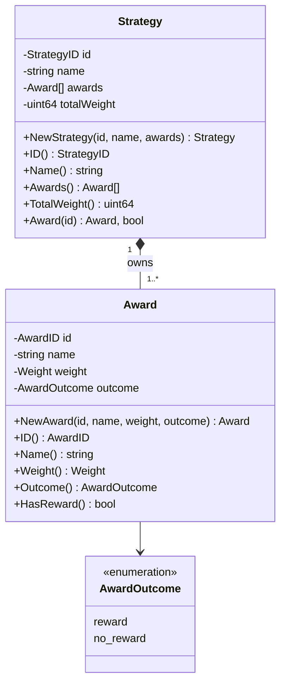

# 第 17 节：最简单随机抽奖需要什么对象

**状态：** 已完成并验收

**日期：** 2026-08-29

**阶段：** 从两张表开始做抽奖

**实现提交：** `0b59217 feat: model lottery strategy domain objects`

**本节只建立 Lottery 的纯领域对象与不变量：`Strategy` 聚合、`Award` 候选、正整数相对权重和显式 `reward` / `no_reward` 语义。没有业务表、Migration、Repository、抽奖算法、业务 API、真实抽奖前端或 Redis 业务缓存，也还没有一次 Draw 的最终结果事实，因此 INV-03 尚未满足。**

## 1. 为什么先建模而不是先写随机数

“随机抽奖”看起来像一个很短的算法题：准备奖品数组，生成随机下标，然后返回一个奖品。但产品系统真正需要先回答的是：

- 哪一份配置决定可选结果；
- 每个结果靠什么稳定标识；
- “谢谢参与”是正常结果还是异常；
- 概率是浮点数、百分比、万分比还是权重；
- 谁保证候选不为空、ID 不重复、总权重不溢出；
- 数据库或 API 给出非法状态时，系统应该拒绝还是偷偷修正；
- Lottery 选择出奖励后，是否等于权益已经到账。

如果这些问题没有唯一答案，随机函数即使统计分布正确，也可能建立在错误的数据和语言上。handler、SQL 和前端还会各自形成一套“奖品”定义，后续规则、库存、发放和幂等出现时只能推倒重来。

因此第三阶段先按以下顺序推进：

```text
第 17 节：定义合法 Strategy / Award
    ↓
第 18 节：把已经明确的模型映射到两张业务表
    ↓
第 19 节：按应用用例定义 Repository 端口与 SQL 适配器
    ↓
第 20 节：在合法聚合上实现无偏的最简单概率抽奖
    ↓
第 21～22 节：再开放 API、接入真实 React 抽奖页
    ↓
第 23～24 节：需求出现后增加规则与 Redis 缓存
```

这让每一节只引入一个主要问题，也让学习分支可以清楚比较“领域—存储—算法—接口—页面—缓存”各自改变了什么。

## 2. 本节开始前的真实状态

第 16 节已经完成 M0 工程底座：

- Go/Gin API 有 liveness、MySQL readiness、类型化配置、结构化日志、统一错误和优雅关闭；
- MySQL 连接、账号隔离和前向 Migration 机制已经可运行，但产品 Migration 集仍为空；
- React 系统状态页真实读取两个探针，`/lottery` 等业务页面仍使用 Mock；
- Compose 可以装配 Web、API、一次性 Migration、MySQL 和隔离的 Redis 占位；
- Redis 还没有 API client、key、TTL、失效或一致性语义。

仓库此前只有 `internal/lottery/.gitkeep`。它表示计划中的模块边界，不表示 Lottery 已经实现。第 17 节删除这个占位文件，并第一次让 `internal/lottery` 承担真实业务职责。

## 3. 本节范围和非目标

### 3.1 交付范围

- 新建持久化和传输无关的 `internal/lottery/domain` 包；
- 定义 `StrategyID`、`AwardID`、`Weight` 和封闭的 `AwardOutcome`；
- 用 `Strategy` 聚合根拥有一组 `Award`；
- 通过构造器一次性建立正 ID、名称、候选集合、权重、Outcome 和总和不变量；
- Strategy 至少一个 Award，AwardID 在 Strategy 内唯一；
- 使用正 `uint64` 相对权重，检查总和溢出；
- 使用显式 `reward` / `no_reward` 区分奖励候选与合法未中奖候选；
- 名称执行 UTF-8、首尾空白、控制字符和 128 rune 契约；
- 防御性复制 slice，并按 AwardID 生成规范顺序；
- 为所有正向、边界、负向和所有权行为编写纯单元测试；
- 用 ADR 固化会约束后续章节的长期决定。

### 3.2 明确不做

- **不建表：** `migrations/sql` 仍为空，`db-status` / `db-migrate` 的空迁移语义不因本节改变；
- **不做 Repository：** 没有 Store interface、SQL、事务、row mapper 或 Unit of Work；
- **不做算法：** 没有 PRNG、随机区间、拒绝采样、权重前缀和或抽奖方法；
- **不做 API：** 没有 `/api/lottery` 路由、DTO、认证、幂等或错误映射；
- **不做真实前端：** `/lottery` 仍是客户端 Mock 演示，不能作为后端抽奖证据；
- **不接 Redis：** Compose Redis 仍是隔离且易失的环境占位，没有业务 key 或 readiness 责任；
- **不建 Activity：** Strategy 不是 Marketing Activity；
- **不建参与资格：** 用户是否能抽、可抽几次属于 Participation 后续需求；
- **不做库存与发放：** `reward` 不表示库存扣减或 Benefit 已到账；
- **不保存 DrawResult：** 当前只有“可被选择的候选”，没有一次抽奖请求和唯一最终结果。

最后一项意味着 [INV-03“一次抽奖只能有一个最终结果”](../../product/non-functional-requirements-v1.md)仍是未来不变量，当前没有实现对象和证据去满足它。

## 4. 统一语言

| 术语 | 本节唯一含义 | 不能解释为 |
| --- | --- | --- |
| `Strategy` | Lottery 内可复用的一组抽奖候选和相对权重配置 | Activity、营销计划、AI Plan |
| `Award` | Strategy 中一个有稳定身份、名称、权重和结果类别的候选 | 已到账积分/券、发放记录、库存 |
| `Weight` | 大于零的相对选择权重 | 百分数、固定万分比、绝对中奖人数 |
| `reward` | 若被选中，存在后续奖励描述需要 Benefit 流程处理 | 已发放、已到账、一定有库存 |
| `no_reward` | 合法完成但不产生奖励的候选 | error、空结果、配置缺失 |
| `TotalWeight` | Strategy 内所有权重经过溢出检查后的和 | 概率百分比或外部可修改字段 |

这组语言延续限界上下文约束：Lottery 只负责策略和结果选择；Marketing 负责活动，Participation 负责资格与次数，Benefit 负责具体权益发放与流水。

## 5. 最小模型



`Strategy` 是聚合根，因为“至少一个候选、ID 不能重复、总权重不能溢出”都是跨 Award 集合的不变量。单独一个 Award 无法保证这些性质。

本节没有 `Draw`、`LotteryResult` 或 `RewardDelivery`。类图中的 Award 只是**配置候选**，不是已经发生的业务事实。

## 6. `Award`：一个合法候选需要什么

创建接口：

```go
func NewAward(
    id AwardID,
    name string,
    weight Weight,
    outcome AwardOutcome,
) (Award, error)
```

构造成功必须同时满足：

| 属性 | 规则 | 失败类别 |
| --- | --- | --- |
| ID | `id > 0` | `ErrAwardIDRequired` |
| 名称 | 合法 UTF-8、trim 后非空、不含控制字符、最多 128 rune | 对应 required/invalid/too-long error |
| 权重 | `weight > 0` | `ErrAwardWeightRequired` |
| Outcome | 只能是 `reward` 或 `no_reward` | `ErrAwardOutcomeInvalid` |

字段保持未导出，包外调用方不能用结构体字面量绕过构造器；观察状态只能使用 getter。Award 没有 setter，因此一旦进入 Strategy，其权重和 Outcome 不会在聚合不知道的情况下改变。

### 6.1 为什么 ID 不能用名称

名称是用户和运营可读文案：它可能改名，也可能出现两个同名“神秘盒子”。若把名称当身份，改文案就会破坏历史引用和未来结果查询。

所以本节允许名称重复，只要求 AwardID 在同一个 Strategy 内唯一。这个决定不会提前锁定第 18 节究竟使用组合主键还是其他 SQL 约束，但它给数据库明确了必须保留的业务语义。

### 6.2 为什么零权重不是“禁用”

零权重候选永远不会被选择，却仍出现在配置中。它可能表示禁用、缺库存、灰度、过期或错误数据，含义无法确定。

当前最小模型拒绝零权重。将来需求出现后，应该显式增加状态或规则，而不是把多个概念压缩进魔法数 `0`。

## 7. `Strategy`：集合不变量的所有者

创建接口：

```go
func NewStrategy(
    id StrategyID,
    name string,
    awards []Award,
) (Strategy, error)
```

构造过程按业务风险排序：

1. 拒绝零 StrategyID；
2. 规范化并校验名称；
3. 拒绝空候选集合；
4. 逐项重新验证 Award，防止包内零值或未来 mapper 绕过；
5. 使用 map 检查同一 Strategy 内 AwardID 唯一；
6. 每次加法前检查 `math.MaxUint64-totalWeight`，拒绝溢出；
7. 复制输入 slice，切断调用方 alias；
8. 按 AwardID 升序排序为规范顺序；
9. 保存只由聚合计算出的 `totalWeight`。

任一步失败都返回零值 Strategy，不返回部分合法聚合。构造器没有外部副作用，因此也不存在“校验失败但已经写了一半数据库”的状态。

### 7.1 单候选为什么合法

只有一个 Award 的 Strategy 是确定性策略，可能用于保底、测试、全量发放或维护期引导。领域不应因为页面叫“随机抽奖”而武断要求至少两个候选。

随机性属于第 20 节的执行机制；候选数量是配置事实。两者不能混在同一个校验里。

### 7.2 全部 `no_reward` 为什么合法

全未中奖策略可能是运营错误，也可能是维护期安全配置。当前领域层没有活动发布、审批或运营风险政策，无法从事实推导“必须至少有一个 reward”。

因此本节允许全部 `no_reward`，把“是否允许发布”留给未来有真实用例的治理规则。允许构造不等于推荐运营使用。

## 8. 权重不是百分比

相对权重只关心比例：

```text
A=1, B=3      与      A=100, B=300
```

两组配置表达相同分布。若未来算法正确实现，则 A 的理论比例是 `1 / (1 + 3)`，B 是 `3 / (1 + 3)`。但本节**没有运行随机实验，也没有算法**；这个计算只解释配置语义。

选择正整数相对权重有四个直接好处：

- 不使用二进制浮点表示十进制概率；
- 不要求所有调整都重新凑成固定 `100` 或 `10_000`；
- 可以由百分比、万分比或运营权重 DTO 无损映射；
- 总和提供未来离散随机区间的清晰边界。

它也产生必须正视的成本：

- UI 以后要计算并展示比例，四舍五入后的显示总和可能不是恰好 100%；
- API 必须解释输入是权重还是百分比；
- 第 18 节必须选择能无损保存所需范围的 SQL 类型；
- 第 20 节必须证明随机数到 `[0, TotalWeight)` 的映射无偏；
- 当前允许 `TotalWeight == math.MaxUint64`，不能在后续偷偷转成有符号 `int64`。

## 9. `reward` 与 `no_reward` 必须显式

以下三种状态完全不同：

| 状态 | 含义 | 是否应该重试抽奖 |
| --- | --- | --- |
| 选中 `reward` Award | 抽奖选择成功，后续存在奖励处理 | 不能因为发放失败重新抽 |
| 选中 `no_reward` Award | 抽奖选择成功，本次没有奖励 | 不能当异常重试 |
| Strategy/算法/依赖 error | 系统未能可信地产生选择 | 需要按未来结果查询和恢复语义处理 |

如果未中奖用 `nil` 或 error 表达，调用方很容易把它当成瞬时故障重试，用户就可能从“谢谢参与”重抽成奖励；如果数据库漏行也返回 `nil`，系统还无法区分业务结果和数据损坏。

所以 `no_reward` 是一个完整 Award：有 ID、名称、正权重和明确 Outcome。它不是空值，也不是特殊的 AwardID 0。

同时，`reward` 只表示 Lottery 选择了奖励描述。它不证明 Benefit 已经受理或到账，更不证明库存已经扣减。第 46～47 节还会专门处理结果快照、发放状态和补偿。

## 10. 名称为何也属于领域契约

Strategy 和 Award 名称会穿过 Go、MySQL、JSON 和浏览器。若每一层使用不同单位和清洗规则，就会出现：

- Go 接受 128 个中文字符，数据库按 128 byte 截断；
- API 保存前 trim，但从数据库读出尾空格后不再相等；
- 控制字符把日志拆成多行或制造不可见文案；
- 无效 UTF-8 进入 JSON 后被替换，身份和展示不一致。

本节定义统一输入契约：

```text
valid UTF-8
→ strings.TrimSpace
→ 结果非空
→ utf8.RuneCountInString <= 128
→ 不含 unicode.IsControl 字符
```

这里的 rune 是 Unicode code point，不是 byte，也不等于用户看到的字素簇。当前不执行 NFC/NFKC normalization，也不要求名称唯一。第 18 节必须让 SQL 类型和读取映射忠实保留这一语义，而不是依赖数据库静默修正。

拒绝控制字符也不等于解决了 XSS：未来 HTML 输出仍必须转义，SQL 仍必须参数化，日志仍必须使用结构化字段。领域校验与输出编码解决的是不同信任边界。

## 11. 为什么要复制 slice 并统一顺序

Go slice 是指向底层数组的描述符。若 Strategy 直接保存调用方传入的 slice，调用方可以在构造成功后替换其中一个 Award，使 `totalWeight`、唯一性检查和实际候选不再一致。

本节在两个方向建立所有权：

```text
调用方 awards
    │  NewStrategy 内复制
    ▼
Strategy 私有 awards
    │  Awards() 再复制
    ▼
调用方只获得快照 slice
```

其次，数据库在没有 `ORDER BY` 时不保证结果顺序，map 迭代也不是业务顺序。如果未来算法、测试或序列化继承偶然顺序，相同 Strategy 可能在不同加载方式下产生不同内部区间。

因此 Strategy 按 AwardID 升序保存候选。这是**规范迭代顺序**，不是：

- 更高中奖优先级；
- 权重排序；
- 运营页面展示顺序；
- SQL 可以省略 `ORDER BY` 的理由。

未来若页面要配置展示顺序，应新增具有明确业务含义的字段。

## 12. 稳定错误类别

本节使用哨兵错误表示领域校验类别：

| 对象 | 错误 |
| --- | --- |
| Strategy | `ErrStrategyIDRequired`、`ErrStrategyNameRequired`、`ErrStrategyNameInvalid`、`ErrStrategyNameTooLong`、`ErrStrategyAwardsRequired` |
| 集合 | `ErrDuplicateAwardID`、`ErrTotalWeightOverflow` |
| Award | `ErrAwardIDRequired`、`ErrAwardNameRequired`、`ErrAwardNameInvalid`、`ErrAwardNameTooLong`、`ErrAwardWeightRequired`、`ErrAwardOutcomeInvalid` |

重复 AwardID 的错误会用 `%w` 包装具体 ID，所以测试和未来 adapter 使用 `errors.Is(err, ErrDuplicateAwardID)`，不解析完整字符串。

这些错误没有 HTTP status、数据库 code 或用户端文案。第 21 节出现 API 后，由 transport adapter 把领域错误映射到稳定公开契约；领域包不导入 Gin 或平台 HTTP fault。

## 13. 包与依赖边界

```text
internal/lottery/domain/
├── doc.go             # 包职责：transport / persistence independent
├── award.go           # AwardID、Weight、Outcome 与 Award
├── strategy.go        # Strategy 聚合、集合校验与规范顺序
├── name.go            # 两类名称共享的规范化/校验机制
├── errors.go          # 稳定领域错误类别
├── award_test.go      # Award 正向、边界和负向测试
└── strategy_test.go   # 聚合不变量、所有权、顺序和查找测试
```

依赖方向是：

```text
未来 HTTP / SQL / Redis adapter
              │
              │ map + construct
              ▼
       lottery/domain
              │
              └── Go 标准库
```

领域包没有：

- `json` 或 `db` struct tag；
- Gin、sqlx、`database/sql` 或 go-redis import；
- 配置、日志、request ID 或 HTTP status；
- MySQL 主键自增、列名或表名；
- DTO 与页面展示类型。

“不依赖持久化”不代表数据永远不保存，而是第 18～19 节的适配器依赖领域契约，不能让领域倒过来依赖 SQL row。

## 14. 测试怎样证明边界

### 14.1 Award 测试

| 场景 | 试图证伪 |
| --- | --- |
| reward 与 no_reward 构造 | 两类合法 Outcome 是否都能保真 |
| 首尾空白 | 构造结果是否真正规范化 |
| 128 个中文 rune | 上限是否按 rune 而非 byte |
| 零 ID、空名、非法 UTF-8、控制字符、超长名 | 不可信名称或身份能否进入对象 |
| 零权重、未知 Outcome | 魔法状态或自由字符串能否绕过封闭词汇 |

### 14.2 Strategy 测试

| 场景 | 试图证伪 |
| --- | --- |
| 双候选正常构造 | 总权重、名称和身份是否保真 |
| 单 Award | 模型是否错误绑死“至少两项” |
| 权重 `2:5` | 是否错误要求固定分母 |
| 最大 `uint64` 单项 | 合法上边界是否被误拒绝 |
| 同名不同 ID | 名称是否被错误当身份 |
| 全 no_reward | 领域是否偷偷加入未定义发布规则 |
| 空候选、零值 Award、重复 ID | 集合不变量是否完整 |
| `MaxUint64 + 1` | 总和是否发生 wrap-around |
| 修改输入和返回 slice | 调用方能否破坏聚合所有权 |
| 三种输入排列 | 规范 AwardID 顺序是否稳定 |
| ID 查找命中/未命中 | 查询语义是否明确区分不存在 |

这些都是纯内存单元测试。它们不能证明：

- MySQL 类型、约束或事务正确；
- Repository 能重建完整聚合；
- 抽奖分布均匀或随机源安全；
- 并发抽奖只有一个最终结果；
- API、浏览器、Redis 或发奖链路可用；
- 10,000 RPS / P99 150ms 候选目标已经达到。

实际执行命令、结果、环境和未覆盖项以[第 17 节 QA](../../qa/lessons/lesson-17.md)为准。

## 15. 如何运行和阅读本节

只验证 Lottery 领域包：

```bash
go test ./internal/lottery/domain
go test -race ./internal/lottery/domain
```

验证整个仓库与文档：

```bash
make verify
```

推荐按下面顺序阅读：

1. `award.go`：理解最小候选和显式 Outcome；
2. `strategy.go`：理解聚合为何拥有集合不变量；
3. `name.go`：理解跨适配层的字符串契约；
4. `errors.go`：理解稳定类别与 transport mapping 分离；
5. 两个测试文件：从反例理解设计边界；
6. [ADR-0013](../../decisions/ADR-0013-lottery-domain-model.md)：理解长期取舍与重评条件；
7. [第一性原理手记](../../design-thinking/lessons/lesson-17.md)：重放更完整的设计推导；
8. [面试问答](../../interview/lessons/lesson-17.md)：练习准确口述与追问。

学习提交时，以第 16 节最终检查点 `f9cdd3c` 为起点查看本节代码：

```bash
git show --stat 0b59217
git diff f9cdd3c..0b59217 -- internal/lottery
```

完整章节还包含实现之后的文档和 QA 提交，因此学习完整交付时以 `origin/codex/lesson-17-lottery-domain-objects` 的最终 tip 为准。

## 16. 本节完成后的真实能力

现在可以诚实地说：

- GrowthOS 拥有第一组可编译、可单测的 Lottery 领域对象；
- Strategy 能拒绝非法身份、名称、空候选、重复 AwardID、零权重、未知 Outcome 和总和溢出；
- Strategy 对候选 slice 取得所有权，并提供稳定 AwardID 顺序；
- 奖励候选与合法未中奖候选已有不同、封闭的业务语义；
- 模型不依赖数据库、HTTP、缓存和前端。

现在**不能**说：

- 已经能在线抽奖；
- 已经有 Lottery API 或真实抽奖页面；
- 已经建了 `strategy` / `strategy_award` 表；
- 已经实现 Repository、概率算法或 Redis 缓存；
- `reward` 已经发放或到账；
- 一次抽奖已经具备幂等和唯一最终结果；
- 抽奖候选性能目标已经压测通过。

尤其，现有 `/lottery` 页面仍由浏览器 Mock 数据和客户端演示逻辑驱动。它与 `internal/lottery/domain` 没有调用链，不能用页面截图证明本节领域对象已接入运行时。

## 17. 对后续章节形成的约束

### 第 18 节：第一次正式业务建表

下一节需要把领域事实映射到 `strategy` 和 `strategy_award`，至少回答：

- ID 的 SQL 类型是否无损覆盖领域契约；
- AwardID 是全局还是 Strategy 内局部，约束如何表达；
- 名称如何保存 128 rune，字符集与 collation 如何选择；
- `reward` / `no_reward` 如何使用可演进的受约束列表示；
- 权重和总和范围怎样避免有符号/无符号截断；
- 外键、级联删除和审计字段是否符合当前生命周期；
- 一个 Strategy 至少一个 Award 这种跨行不变量由谁在事务中保证；
- 首个 `000001` Migration 如何前向执行、失败停止和真实 MySQL 验证。

第 18 节只应解决持久化结构，不应顺便把 Repository、随机算法或 API 全部做掉。

### 第 19～24 节

- 第 19 节 Repository 必须通过构造器重建聚合，不能直接绕过私有字段；
- 第 20 节算法必须使用相对权重和规范候选，不把 `no_reward` 当 error；
- 第 21 节 DTO 必须解释权重/Outcome，并把领域错误映射到公开契约；
- 第 22 节必须删掉或隔离对应 Mock，真实页面不能继续用客户端随机替代服务端事实；
- 第 23 节规则出现时，应建立显式规则模型，而不是借用零权重或名称；
- 第 24 节缓存只能保存可重建派生数据，必须定义 key、TTL、失效和数据库权威来源。

## 18. 复盘

本节的代码量不大，但它建立了整个抽奖主线最早的“不可说谎边界”：

```text
配置候选 ≠ 一次抽奖结果
Strategy ≠ Activity
Award ≠ 已到账 Benefit
no_reward ≠ error
相对权重 ≠ 固定百分比
规范 ID 顺序 ≠ 展示顺序
领域模型 ≠ SQL row / HTTP DTO
```

这些区别让后续每个章节可以增加一类真实复杂度，同时知道哪些业务语义不能被技术适配器改变。

下一节进入第一个业务 Migration：只为已经存在的 Strategy/Award 契约建两张表，并通过真实 MySQL 验证前向结构演进，不提前实现 Repository 或在线抽奖。

## 19. 关键文件与证据

| 文件 | 责任 |
| --- | --- |
| `internal/lottery/domain/award.go` | Award 身份、相对权重、封闭 Outcome 与本地不变量 |
| `internal/lottery/domain/strategy.go` | 聚合构造、唯一性、溢出检查、所有权、规范顺序和查找 |
| `internal/lottery/domain/name.go` | Strategy/Award 名称的统一规范化契约 |
| `internal/lottery/domain/errors.go` | 稳定领域错误类别 |
| `internal/lottery/domain/award_test.go` | Award 正向、边界与非法输入测试 |
| `internal/lottery/domain/strategy_test.go` | 聚合集合、数值、别名、顺序与查找测试 |
| [ADR-0013](../../decisions/ADR-0013-lottery-domain-model.md) | 长期领域契约、备选方案和重评触发器 |
| [第 17 节 API 记录](../../api/lessons/lesson-17.md) | 明确本节没有新增 HTTP/前端 API |
| [第 17 节 QA](../../qa/lessons/lesson-17.md) | 实际命令、结果与证据边界 |
| [第 17 节第一性原理设计手记](../../design-thinking/lessons/lesson-17.md) | 架构师从事实到模型的完整推导 |
| [第 17 节面试问答](../../interview/lessons/lesson-17.md) | 可口述回答、追问、项目证据与外部参考 |
