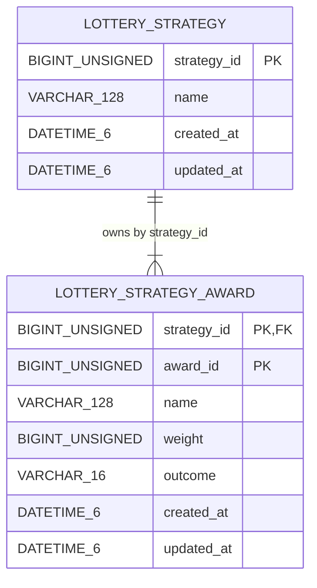

# 第 18 节：第一次正式业务建表

**状态：** 实现完成，最终章节门禁与提交信息以 QA/分支检查点为准

**日期：** 2026-08-29

**阶段：** 从两张表开始做抽奖

**本节只把第 17 节已经明确的 Lottery `Strategy` / `Award` 配置模型映射成两张 MySQL 8.4 业务表，并把 Migration、数据库约束、应用账号最小权限和可复现集成验证建立起来。没有 Repository、业务读写用例、概率算法、Lottery HTTP API、真实 React 抽奖链路或 Redis 业务缓存。**

## 1. 为什么“建两张表”值得单独成为一节

把 Go struct 翻译成几列 SQL 并不困难；困难的是决定哪些语义应由数据库守住，哪些必须留给领域与 Repository，以及失败后系统处于什么可解释状态。

第 17 节已经给出以下领域事实：

- Strategy ID、Award ID 和 Weight 都是正 `uint64`；
- Strategy 至少有一个 Award；
- Award ID 只要求在 Strategy 内唯一；
- Award 名称、Strategy 名称都有 128 rune、Unicode 空白和控制字符契约；
- Weight 是正整数相对权重，总权重必须避免 `uint64` 溢出；
- Outcome 只有 `reward` 与 `no_reward`；
- Award 是候选配置，不是一次抽奖结果，也不等于权益已发放。

数据库层不能机械照抄这些句子。它必须回答：

1. `uint64` 如何无损落到 MySQL；
2. Award 的“策略内身份”如何变成键；
3. 是否使用外键，以及删除父记录时如何处理；
4. Outcome 使用 ENUM、字典表还是字符串加 CHECK；
5. 字符集、排序规则和名称边界如何避免静默折叠；
6. 哪些领域不变量无法由单行约束表达；
7. 两张表是否应写在同一个 Migration；
8. 业务应用在 Repository 尚未出现时究竟需要什么权限；
9. 已复用的本地 MySQL volume 如何从旧的通配授权收敛到精确授权；
10. 如何用真实 MySQL 而不是只靠字符串断言证明 DDL 行为。

所以本节目标不是“DDL 能执行”，而是建立一份可审查、可迁移、可失败关闭、可由后续 Repository 安全重建领域对象的持久化契约。

## 2. 本节之前与之后的能力边界

### 2.1 开始前

- 第 13 节已经有独立 `growth-migrate up/status`、dirty/version mismatch 语义和 API/Migrator 身份隔离；
- 第 16 节已经用 Compose 编排 MySQL、Migration、API、Web 和 Redis 占位；
- 第 17 节已经有纯 Go Strategy/Award 领域对象，但数据库还没有任何业务表；
- API 只把 MySQL 用于启动和 readiness Ping，没有 Lottery 查询；
- `/lottery` 仍是前端 Mock。

### 2.2 完成本节后

- 嵌入 Migration 历史从空集变为版本 1、2；
- `lottery_strategy` 与 `lottery_strategy_award` 成为第一组业务表；
- MySQL 能拒绝零 ID、零权重、非法 Outcome、孤儿 Award、同策略重复 Award ID、129 个字符名称和带基本首尾空格的名称；
- Compose 启动顺序变为 `mysql healthy → migrate clean v2 → mysql-grants 精确收敛 → api`；
- `growthos_app` 在本节只有两张业务表的 `SELECT`，不能写业务表，也不能读写 `schema_migrations`；
- 真实 MySQL 集成测试能用独立 Migrator/API 身份验证结构和权限。

### 2.3 仍然没有

- Repository interface、SQL adapter、row mapper、事务封装或业务查询；
- Strategy 的在线创建、更新、删除或加载用例；
- 加权随机算法、随机源、抽奖结果或幂等；
- `/api/lottery/**` 业务路由和 DTO；
- React 对这两张表的任何真实读取；
- Redis key、TTL、缓存回源或失效协议；
- Activity、Participation、库存、Benefit 或 DrawResult 表。

表存在不等于业务功能已经可用；它只意味着“合法配置有了可持续演进的存储形状”。

## 3. 表关系与统一语言



命名使用 `lottery_` 前缀，原因不是为了把所有表都变成长名字，而是让模块化单体共享一个 schema 时仍能一眼看出事实所有者。表名没有使用笼统的 `strategy`，避免与 Marketing、AI Plan 或未来其他上下文的“策略”混淆。

## 4. Migration 000001：`lottery_strategy`

文件：[`000001_create_lottery_strategy.up.sql`](../../../migrations/sql/000001_create_lottery_strategy.up.sql)

| 列/约束 | SQL 设计 | 对应语义 |
| --- | --- | --- |
| `strategy_id` | `BIGINT UNSIGNED NOT NULL`，主键，`CHECK > 0` | 无损保存正 `uint64`；零值不合法 |
| `name` | `VARCHAR(128) utf8mb4_0900_bin NOT NULL` | 最多 128 个 MySQL 字符，二进制敏感比较 |
| `created_at` | `DATETIME(6)` 自动初始化 | 行创建元数据 |
| `updated_at` | `DATETIME(6)` 自动初始化并在该行更新时刷新 | 行级最后修改元数据 |
| `chk_lottery_strategy_name_basic` | `CHAR_LENGTH(name) > 0 AND name = TRIM(name)` | 数据库可表达的最小非空/首尾 U+0020 空格子集 |

没有 `AUTO_INCREMENT`。领域 ID 已经是外部可提供的稳定身份；在没有 ID 生成用例前让数据库隐式生成，会把创建协议、分布式生成和返回 ID 行为一起提前锁死。

没有 `status`、`version`、`published_at`。当前领域没有草稿/发布/审核/灰度状态，也还没有乐观锁用例。为“以后可能用到”预留的列会制造没有所有者的空语义。

## 5. Migration 000002：`lottery_strategy_award`

文件：[`000002_create_lottery_strategy_award.up.sql`](../../../migrations/sql/000002_create_lottery_strategy_award.up.sql)

| 列/约束 | SQL 设计 | 对应语义 |
| --- | --- | --- |
| `strategy_id` | `BIGINT UNSIGNED NOT NULL` | 所属 Strategy |
| `award_id` | `BIGINT UNSIGNED NOT NULL`，`CHECK > 0` | Strategy 内 Award 身份 |
| 主键 | `(strategy_id, award_id)` | 同一 Strategy 内唯一，不强迫全局唯一 |
| 外键 | `strategy_id → lottery_strategy.strategy_id` | 禁止孤儿 Award |
| FK 动作 | `ON DELETE RESTRICT ON UPDATE RESTRICT` | 不让数据库暗中级联删除/改写聚合内容 |
| `name` | `VARCHAR(128) utf8mb4_0900_bin NOT NULL` | 与 Strategy 相同存储上限和比较基线 |
| `weight` | `BIGINT UNSIGNED NOT NULL CHECK > 0` | 无损保存正 `uint64` 相对权重 |
| `outcome` | `VARCHAR(16) ascii_bin NOT NULL CHECK IN (...)` | 只允许 `reward` / `no_reward`，大小写敏感 |
| 时间列 | 两个 `DATETIME(6)` | 仅为 Award 行元数据 |

### 5.1 为什么是复合主键

领域只要求 Award ID 在一个 Strategy 内唯一。复合主键直接表达这条事实，并自然支持未来最核心的读取形状：

```sql
WHERE strategy_id = ?
ORDER BY award_id
```

MySQL 的复合 B-tree 主键可以利用最左前缀 `strategy_id` 查询某策略奖项。本节没有凭猜测增加 `name`、`outcome`、`updated_at` 或 `weight` 二级索引；第 19 节出现真实 SQL 与执行计划后再决定。

### 5.2 为什么显式外键且使用 RESTRICT

没有外键时，任何绕过应用的脚本都能留下孤儿 Award；使用 CASCADE 又会让一次父表删除隐式变成多行破坏动作，而且当前还没有“删除 Strategy”的业务用例、审计和恢复协议。

`RESTRICT` 选择的是“先显式处理子记录，再处理父记录”。它不是说系统永远不删除 Strategy，而是说本节不授予数据库一个尚未设计的级联删除业务语义。

### 5.3 为什么不是 MySQL ENUM

`ENUM('reward','no_reward')` 能限制取值，但类型定义与数据字典紧耦合，未来增加值必须修改列定义；其内部还具有序号表示和排序语义，容易让查询者误用。当前使用 `VARCHAR(16) CHARACTER SET ascii COLLATE ascii_bin + CHECK`：

- 值仍被数据库严格限制；
- 存储和比较语义清楚；
- 未来扩展通过显式前向 Migration 修改 CHECK；
- 不需要再建一张只有两个稳定值的字典表。

这不是宣称“VARCHAR 永远优于 ENUM”；如果取值集合极其稳定、空间规模巨大且团队熟悉 ENUM 演进，ENUM 仍是可选方案。

## 6. 数值映射：为什么用 `BIGINT UNSIGNED`

Go 领域类型的上限是 `math.MaxUint64`。MySQL 有符号 `BIGINT` 只能覆盖 `0..2^63-1` 的正半区，不能无损保存完整 `uint64`。因此 ID 和 Weight 都选择 `BIGINT UNSIGNED`。

这带来三个后续责任：

1. Repository 扫描必须继续使用 `uint64`，不能偷转为 `int64`；
2. API 不能把任意 `uint64` 直接当 JavaScript 安全整数，需要第 21 节决定字符串或收窄范围；
3. 跨行总和仍可能溢出，即使每一行都合法，数据库也没有用当前 CHECK 防止多个 Weight 求和超过 `MaxUint64`。

真实集成测试分别把 StrategyID、AwardID、Weight 写到 `math.MaxUint64` 并读回，用来证伪“某一列或 driver 扫描路径仍只支持有符号范围”的错误假设。

## 7. 字符集、排序规则与名称契约的精确边界

两张表默认使用 InnoDB、`utf8mb4` 与 `utf8mb4_0900_bin`；`outcome` 单独使用 `ascii_bin`。

### 7.1 为什么是 `utf8mb4`

MySQL 的 `utf8mb4` 支持四字节 Unicode 编码，可保存中文和补充平面字符。`VARCHAR(128)` 的长度按字符而非字节解释；集成测试验证 128 个中文字符成功、129 个被拒绝。

### 7.2 为什么是 `_bin`

名称不是身份，但数据层不应在没有业务决策时把大小写、重音或 Unicode 形式自动折叠成“相同”。`utf8mb4_0900_bin` 提供可预测的二进制敏感比较。本节还验证预组字符 `é` 与分解形式 `e + ◌́` 可以作为不同原始值保存和比较。

这不等于已经做 Unicode NFC/NFKC 规范化，也不等于解决同形异义字符、国际化搜索或用户感知字素问题。

### 7.3 `name_basic` 为什么叫 basic

SQL CHECK：

```sql
CHAR_LENGTH(name) > 0 AND name = TRIM(name)
```

MySQL 当前表达的是基础子集：非空，并拒绝默认 `TRIM` 处理的首尾 ASCII U+0020 空格。它**不等价**于第 17 节 Go `strings.TrimSpace` 对 Unicode 空白的处理，也不拒绝名称内部控制字符。

因此约束名使用 `*_name_basic`，不能叫 `canonical` 或 `domain_valid`。第 19 节 Repository 从行重建聚合时必须调用领域构造器：若数据库中存在仅满足 SQL 子集、但违反完整领域名称规则的旧数据，加载必须 fail closed，不能跳过构造器或静默 trim 后继续。

## 8. 数据库能守住与不能守住的不变量

| 不变量 | 数据库本节能否直接保证 | 机制/后续责任 |
| --- | --- | --- |
| Strategy ID > 0 | 能 | CHECK |
| Award ID > 0 | 能 | CHECK |
| Weight > 0 | 能 | CHECK |
| Outcome 封闭 | 能 | ascii_bin + CHECK |
| 同 Strategy 内 Award ID 唯一 | 能 | 复合主键 |
| Award 必须属于存在的 Strategy | 能 | 外键 |
| 父记录不可隐式级联删除 | 能 | RESTRICT |
| 名称不为空、无首尾 U+0020 | 能 | `name_basic` CHECK |
| 128 个 MySQL 字符上限 | 能 | VARCHAR(128) + strict SQL mode |
| 完整 Go TrimSpace/控制字符契约 | 不能 | 第 19 节领域重建 fail closed |
| Strategy 至少一个 Award | 不能由当前两表静态约束保证 | Repository 写事务 + 领域构造；未来发布门禁 |
| 所有 Award Weight 总和不溢出 uint64 | 不能由单行 CHECK 保证 | 领域构造器/Repository 事务中验证 |
| Award 顺序具有业务含义 | 当前没有该事实 | 不新增 position |
| 一次抽奖唯一最终结果 | 不能；本节没有 DrawResult | 后续参与/结果模型 |

“数据库做不到”不等于“不需要保证”。它表示责任必须落到明确的应用边界和测试中，而不能在文档里假装两张表已经覆盖全部聚合不变量。

## 9. 为什么拆成两条 Migration

版本 1 只创建父表，版本 2 创建子表和外键。理由是 MySQL atomic DDL 的原子边界是单条受支持 DDL，不是整个多语句 Migration 文件。

```text
v1 CREATE lottery_strategy 成功
    ↓ 记录 clean v1
v2 CREATE lottery_strategy_award 失败
    ↓ migration 状态为 v2 dirty；API 启动门不通过
```

把两条 CREATE 写进同一文件，并不会得到“要么两张都创建、要么都不创建”的事务语义。拆分后，失败现场更清楚：父表是已完成的 v1，子表是需要检查副作用的 dirty v2。恢复仍然必须按 runbook 核实实际对象，不能把拆分误称为自动回滚。

每个 Migration 源文件还有 SHA-256 不可变测试与“一个分号”检查。它不是密码学供应链签名，但能在仓库内阻止误改已经发布的初始历史；任何变更必须新增更高版本。

## 10. 应用账号为什么本节只有 SELECT

第 16 节初始化脚本曾给应用账号 schema 级 DML。第 18 节出现真实表后，这种通配授权会产生两个问题：

- API 账号能修改 `schema_migrations`，破坏迁移事实；
- Repository 尚未实现，API 没有任何正当业务写路径，却已经拥有 INSERT/UPDATE/DELETE。

因此本节将 `growthos_app` 收敛到：

```text
USAGE ON *.*
SELECT ON growthos.lottery_strategy
SELECT ON growthos.lottery_strategy_award
```

第 19 节出现真实 Repository SQL 后，再按用例增加恰好需要的表级 DML。最小权限是随能力演进的白名单，不是一次授予后永久不变的口号。

## 11. Compose 中的授权收敛生命周期

MySQL 官方初始化目录只在数据目录首次初始化时执行。仅修改 init 脚本不会改变已经存在的 `mysql_data` volume，因此不能靠它撤销旧通配权限。

本节增加 one-shot `mysql-grants`：

```text
mysql healthy
    └─> migrate up（专用网络账号，clean v2）
          └─> mysql-grants
  ├─ root Secret
  ├─ 共享 Unix socket，只读挂载
  ├─ network_mode: none
  ├─ REVOKE ALL + 精确 GRANT
  ├─ SHOW GRANTS 与完整 allowlist 比较
  └─ @@GLOBAL.mandatory_roles 必须为空
                └─ success ─> api 启动
```

关键点：

- 先迁移再授权，因为表级 GRANT 需要目标表存在；
- 使用 Unix socket，不加入 Compose 网络，减少 root 会话的网络面；
- `network_mode: none` 不是“没有任何 IPC”，共享 socket 本身就是显式 IPC；
- root Secret 只挂给这一 one-shot 容器，不给 API/Migrator；
- 先撤销再授予，能收敛复用 volume 中遗留的表、列、routine 或通配权限；
- 最后比较完整排序后的 `SHOW GRANTS`，不仅检查“所需权限存在”，也检查“额外权限不存在”；
- direct grant 相等仍不足以排除强制角色扩权；`@@GLOBAL.mandatory_roles` 非空时任务失败关闭；
- API 依赖授权任务成功，授权偏差会 fail closed。

`/var/lib/mysql` 还挂入一个显式空的只读目录，覆盖 MySQL 镜像声明的数据卷，避免该只读 one-shot 客户端容器无意创建匿名可写数据卷。真正数据库数据仍只在 `mysql` 服务的 `mysql_data` 中。

## 12. 时间戳的含义不能被夸大

两张表各有 `created_at` 与 `updated_at`，使用 UTC 会话下的 `DATETIME(6)` 自动初始化/更新。它们只回答“这一行何时创建/最后被 MySQL 更新”。

它们不是：

- 聚合版本号；
- 乐观锁 token；
- HTTP ETag；
- 缓存命名空间；
- Strategy 整体最后修改时间；
- 审计事件或操作人记录。

更新 `lottery_strategy_award` 不会自动更新父表 `lottery_strategy.updated_at`。如果未来需要聚合级版本、并发控制、增量同步或缓存失效，必须新增明确机制，不能拿父表时间戳凑合。

## 13. 验证策略

### 13.1 静态与单元证据

- 嵌入文件存在且内容 checksum 固定；
- 每个初始 Migration 只有一个语句终止符；
- Migration 命令、Runner 和生产装配对真实非空迁移集保持兼容；
- Compose 配置、shell 脚本与 Go 格式/测试门禁不回归。

### 13.2 真实 MySQL 集成证据

显式门禁只允许指向独立、一次性 schema，并要求：

```bash
export GROWTHOS_TEST_MYSQL_ALLOW_SCHEMA_CHANGES=lesson-18-isolated-schema
make test-integration-mysql
```

测试检查：

- Migrator 与 API 身份不同但指向同一测试地址/数据库；
- Migration 达到 clean latest version 2；
- 两表为 InnoDB + `utf8mb4_0900_bin`；
- API 可读两表、不可写业务表、不可读写版本表；
- 正确保存 128 个中文字符，StrategyID/AwardID/Weight 三个 `MaxUint64`，以及两种 Unicode 表示；
- 分别拒绝名称开头与结尾的 ASCII U+0020 空格；
- 真实拒绝零值、非法 Outcome、孤儿、重复复合键、受引用父删除与 129 字符；
- 数据探针位于事务中并回滚，权限回归时写探针也不会污染数据。

显式 opt-in、同库校验和分离账号不是多余手续：这些测试会执行 DDL 与负向写入，不能误指向用户常用数据库。

### 13.3 Compose 冒烟证据

`make compose-smoke` 额外检查：

- MySQL/API/Redis/Web 运行且健康；
- Migrate/MySQL-grants 都以 exit 0 完成；
- 镜像版本为 lesson-18；
- `schema_migrations=2:0`；
- 两个 `name_basic` 约束存在且旧的误导性 canonical 标签不存在；
- API 完整 grant 集恰好等于 allowlist；
- API 无 `schema_migrations` 访问权；
- 没有新增宿主机 MySQL/Redis/API 端口；
- 原有 HTTP 健康、readiness、404 和 request ID 契约不变。

精确命令、环境、已执行结果和清理说明见[第 18 节 QA](../../qa/lessons/lesson-18.md)。

## 14. 常见误解

### 14.1 “有两张表，所以 Repository 已经完成”

错误。当前 API 没有 SQL 查询，只有 readiness Ping；表的 `SELECT` 权限是为第 19 节加载准备的最小面，不是已经存在的用例。

### 14.2 “有 weight，所以抽奖概率已实现”

错误。Weight 只是持久化配置。没有随机源、区间映射、拒绝采样、边界测试或统计验证。

### 14.3 “updated_at 能做乐观锁”

错误。没有 `WHERE updated_at = old` 的 Repository 写协议，也没有聚合级版本含义；微秒精度也不自动等于无冲突版本。

### 14.4 “CHECK 已经完整实现 Go 名称规则”

错误。`name_basic` 只覆盖非空和首尾 U+0020；Unicode TrimSpace、控制字符等由第 19 节领域重建再次验证。

### 14.5 “外键保证 Strategy 永远至少一个 Award”

错误。外键只保证每个 Award 的父记录存在，允许一个 Strategy 暂时或永久没有子行。至少一个 Award 是跨行聚合不变量。

### 14.6 “root 容器没有网络，因此完全没有攻击面”

错误。它通过 Unix socket 与 MySQL 通信并持有短生命周期 root Secret；安全来自最小挂载、无网络、只读根文件系统、一次性生命周期、精确脚本和 fail-closed 验证的组合。

## 15. 对下一节的明确交接

第 19 节 Repository 必须至少回答：

1. 如何在一个一致读取中加载 Strategy 与全部 Award；
2. 行扫描类型如何无损处理 `uint64`；
3. 如何按 `award_id` 形成确定顺序；
4. 如何调用 `NewAward` / `NewStrategy` 重建，而不是绕过不变量；
5. 数据库仅满足 `name_basic`、但领域名称非法时返回什么稳定错误；
6. 写入一个完整聚合时如何在事务中避免空 Strategy 与部分 Awards；
7. 如何检查总权重溢出；
8. 真实 SQL 需要哪些 INSERT/UPDATE/DELETE，再如何扩展应用权限；
9. 是否需要并发版本、锁、删除或更新用例；没有需求时不要猜；
10. Repository 错误怎样与 not found、corrupt data、dependency failure 区分。

只有 Repository 建立后，表才成为领域对象的可用持久化适配器；只有第 20～22 节完成后，才可能讨论算法、API 和前端真实链路。

## 16. 参考资料

- [MySQL 8.4 CREATE TABLE](https://dev.mysql.com/doc/refman/8.4/en/create-table.html)
- [MySQL 8.4 CHECK Constraints](https://dev.mysql.com/doc/refman/8.4/en/create-table-check-constraints.html)
- [MySQL 8.4 FOREIGN KEY Constraints](https://dev.mysql.com/doc/refman/8.4/en/create-table-foreign-keys.html)
- [MySQL 8.4 Integer Types](https://dev.mysql.com/doc/refman/8.4/en/integer-types.html)
- [MySQL 8.4 utf8mb4](https://dev.mysql.com/doc/refman/8.4/en/charset-unicode-utf8mb4.html)
- [MySQL 8.4 Multiple-Column Indexes](https://dev.mysql.com/doc/refman/8.4/en/multiple-column-indexes.html)
- [MySQL 8.4 Atomic DDL](https://dev.mysql.com/doc/refman/8.4/en/atomic-ddl.html)
- [MySQL 8.4 Automatic TIMESTAMP/DATETIME Initialization](https://dev.mysql.com/doc/refman/8.4/en/timestamp-initialization.html)
- [MySQL 8.4 GRANT](https://dev.mysql.com/doc/refman/8.4/en/grant.html)
- [MySQL 8.4 REVOKE](https://dev.mysql.com/doc/refman/8.4/en/revoke.html)
- [ADR-0014：Lottery 持久化结构](../../decisions/ADR-0014-lottery-persistence-schema.md)
- [ADR-0015：Compose 精确授权收敛](../../decisions/ADR-0015-compose-schema-grant-reconciliation.md)

## 17. 本节复盘

第 18 节第一次让 Migration 改变真实业务结构，但它有意只完成“持久化形状与运行权限”这一层。两张表用复合主键、外键 RESTRICT、无符号大整数、二进制敏感排序规则和 CHECK 保存数据库能够独立守住的事实；数据库无法表达的至少一个 Award、跨行总权重与完整 Unicode 名称规则，明确交给第 19 节通过领域构造器 fail closed。

同样重要的是权限生命周期：已有 volume 不会重新执行 init 脚本，因此新增 socket-only、无网络的一次性授权任务，把应用身份从 schema 通配 DML 收敛到当前真实需求的两表 SELECT，并在 API 启动前比对完整授权白名单。

这是一套可以继续演进的底座，但还不是一个能抽奖的产品功能。准确描述边界，本身就是工程可信度的一部分。
