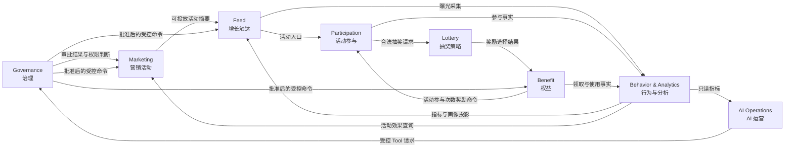

# 限界上下文地图 v1

**状态：** v1 分析基线

**更新日期：** 2026-08-30

**来源章节：** [第 6 节：第一次划分限界上下文](../course/part-01/lesson-06-first-bounded-contexts.md)；第 17～23 节依次以 Lottery 对象、持久化、仓储、选择、API、React 消费者和规则所有权校准业务边界；第 24 节以[Redis Strategy 读取投影](../course/part-03/lesson-24-redis-strategy-cache.md)校准派生数据边界；第 25 节以[Participation 新用户资格切片](../course/part-04/lesson-25-user-eligibility.md)校准外部用户事实与内部业务决定边界

## 1. 地图用途

本地图基于第 5 节领域事件地图，明确当前业务语言边界、职责、事实所有权和上下文协作方式。它服务于后续建模和评审，不等于微服务图、数据库图、Go 包结构或最终组织架构。

当前实现策略仍是 Modular Monolith。第 17～22 节在单仓库内逐步建立 Lottery domain、API 进程中的 application/adapters、共享 MySQL schema 中的两张表和 React 消费者；第 24 节的 `strategycache` 只是 Lottery adapter 下对 `StrategyReader` 的技术装饰，`redisstore` 是 infrastructure client。Redis 运行在独立技术进程并保存可丢弃投影，但它不是新的限界上下文、事实所有者、独立业务事实库或通用“缓存领域”；Strategy 的权威事实仍归 Lottery/MySQL。第 25 节在同一仓库增加独立 Participation domain/application 包，但没有把它装配为第二个服务，也没有新建数据库：外部用户目录拥有注册原始事实，Participation 只拥有对受控快照形成的业务资格决定。只有真实的团队协作、负载、可用性或数据边界证明拆分有价值时，才讨论业务模块的物理拆分。

## 2. 划分依据

一次边界划分至少回答五个问题：

1. 同一个术语在边界内是否只有一种含义；
2. 业务规则和生命周期是否一起变化；
3. 哪个模型有权确认事实成立；
4. 哪些数据是事实，哪些只是引用、快照或查询投影；
5. 边界变化的原因是否与其他模型明显不同。

本地图不按后台菜单、数据库表和技术中间件切分。

## 3. 上下文地图

箭头表示业务依赖或信息协作，不表示已经选择同步 HTTP、gRPC、消息队列或共享数据库。

## 4. 职责与非职责

| 上下文 | 负责 | 明确不负责 |
| --- | --- | --- |
| Marketing | 活动草稿、版本、目标、预算、渠道和生命周期 | 抽奖算法、参与次数、权益到账、Feed 排序、AI 推理 |
| Lottery | Strategy、Award、概率、抽奖规则和结果选择 | 活动发布、用户额度、积分或优惠券实际发放 |
| Participation | 资格、参与次数、活动 SKU 额度、参与订单和幂等 | 用户身份主数据、抽奖概率、权益余额 |
| Benefit | Reward、Points、Coupon 等权益的发放、余额、流水、使用和补偿 | 活动参与次数事实、活动生命周期、抽奖选择、Feed 排序 |
| Feed | FeedItem、召回、过滤、排序、频控、游标和实验分配 | 活动与权益主数据、行为归因事实 |
| Behavior & Analytics | 行为采集、画像、漏斗、实验指标和归因 | 修改交易事实、决定活动状态或权益余额 |
| Governance | 身份权限、审批策略、风险等级和审计 | 活动发布、权益交付、AI 推理 |
| AI Operations | AI Task、意图、计划、Tool 编排和人工接管 | 直接拥有或修改活动、权益与分析事实 |

## 5. 事实与数据所有权

| 事实或数据 | 权威上下文 | 其他上下文如何使用 |
| --- | --- | --- |
| 活动版本与运行状态 | Marketing | Feed 使用可投放摘要；Analytics 使用活动标识和快照 |
| 审批结果与审计轨迹 | Governance | Marketing 将审批结果作为发布条件；AI 展示状态 |
| 账户注册原始事实 | 外部用户目录 | Participation 只通过受控事实端口消费带来源、修订和观察时刻的快照，不复制可独立修改的权威写模型 |
| 用户资格、参与次数与参与订单 | Participation | 当前已实现一条未装配的新用户资格决定；未来 Lottery 只接收已验证请求，Analytics 接收参与事件 |
| 抽奖策略配置 | Lottery | Marketing 未来引用 Strategy；当前已有 Strategy/Award、两张表、内部 Create/FindByID Repository、可重建 Redis 读取投影、加权选择器、只读 ephemeral API 与真实 React 消费者，但没有运营配置入口或发布模型 |
| 一次抽奖的最终结果 | Lottery | Benefit 接收奖励结果；当前只有不持久化的临时选择，尚无正式 Draw/Result、结果查询或幂等 API，INV-03 未满足 |
| 积分、优惠券等权益事实 | Benefit | Feed/Marketing 读取必要摘要；Analytics 接收领取和使用事件 |
| 活动参与次数事实 | Participation | Benefit 可因奖励请求增加次数，但由 Participation 确认结果 |
| Feed 候选、顺序、游标与频控 | Feed | Behavior 接收曝光采集数据；Marketing 查询触达摘要 |
| 行为明细、画像、漏斗与实验指标 | Behavior & Analytics | Feed 用于排序；Marketing 和 AI 只读查询 |
| AI 计划与 Tool 执行过程 | AI Operations | Governance 审批；业务上下文只接收合法命令 |

其他上下文不得复制一份可独立修改的权威事实。为性能保存的冗余字段必须明确来源、更新时间和失效策略。

## 6. 命令、查询、事件与审计跨边界关系

| 交互类型 | 含义 | 所有权规则 | 当前是否锁定协议 |
| --- | --- | --- | --- |
| 命令 | 请求另一个上下文改变业务状态 | 接收方校验并确认，发送方不能宣布成功 | 否 |
| 查询模型 | 获取当前场景需要的摘要或投影 | 来源事实仍归提供方 | 否 |
| 集成事件 | 传播已经确认的业务事实 | 生产方定义语义，消费方不得改写原事实 | 否 |
| 审计记录 | 记录请求、批准、拒绝和执行过程 | Governance 或执行方按用途保存 | 否 |

用户参与主链路可能要求及时返回；行为分析通常可以延迟传播；权益发放可能同步确认，也可能异步补偿。具体选择必须由第 7 节 NFR 和后续压测、故障场景推动。

## 7. 统一语言

| 术语 | 唯一含义 | 禁止混用 |
| --- | --- | --- |
| Activity / 活动 | 带目标、时间窗和生命周期的营销活动 | Strategy、AI Task |
| Strategy / 策略 | Lottery 内可复用的抽奖决策配置 | Activity、通用“方案” |
| Award / 奖项候选 | Strategy 内可被选择的身份、名称、相对权重与 reward/no_reward 结果描述 | 已到账权益、库存、一次抽奖结果 |
| Participation / 参与 | 用户对活动的一次受控参与事实 | 点击、曝光 |
| Quota / 参与次数 | 用户可使用的活动参与额度 | 积分、会员余额 |
| Reward / 奖励 | 业务承诺交付给用户的奖励描述 | 已到账权益 |
| Benefit / 权益 | 进入发放、持有和使用生命周期的具体权益 | 抽奖结果 |
| Event / 事件 | 已发生并由权威上下文确认的业务事实 | 命令、按钮、技术日志 |
| Plan / 计划 | AI 的结构化执行步骤 | Marketing Activity |
| Task / 任务 | 系统或 AI 的执行任务 | 活动、用户旅程 |
| Account / 账户 | 必须带语境的状态与流水模型 | 无限定词的通用实体 |

`Campaign` 与 `Activity` 当前在中文产品文档中统一称“活动”。后续编码阶段再结合现有生态和团队语言选择代码名，不能同时制造两个同义聚合。

### 7.1 第 17～25 节 Lottery/Participation 语言、持久化、选择、临时传输、规则与派生缓存边界

第 17 节把本地图中的一小段分析语言落成 `internal/lottery/domain`：

- `Strategy` 是聚合根，拥有至少一个 `Award`；
- `StrategyID` 与 `AwardID` 是正身份，AwardID 在 Strategy 内唯一；
- `Weight` 是正 `uint64` 相对权重，不是百分比或固定万分比；
- `reward` 表示后续存在奖励处理，`no_reward` 表示合法未中奖；两者都只是候选语义；
- Award 名称可重复，身份不能依赖文案；
- Strategy 按 AwardID 建立规范迭代顺序，但该顺序不是运营展示顺序或中奖优先级；
- Lottery 对象不包含 Activity 时间窗、Participation 次数或 Benefit 到账状态。

第 18 节再把当前配置事实映射为两张表：`lottery_strategy` 保存聚合根身份、名称与行元数据，`lottery_strategy_award` 以 `(strategy_id, award_id)` 标识 Strategy 内候选，并保存名称、正整数相对权重和 outcome。外键 `RESTRICT` 防止孤儿引用和误删父行，但数据库不会因此拥有 Lottery 的业务语义：

- `*_name_basic` 只覆盖非空与首尾 ASCII U+0020 空格，不等价于 Go 名称契约；
- FK 不能保证 Strategy 至少有一个 Award；
- 单行 CHECK 不能验证跨行总权重不溢出；
- 行 `updated_at` 不是聚合版本，Award 更新不会自动推进根行；
- 两张表仍不能单独保证完整聚合合法性，必须由 Repository 在写前和恢复后通过领域规则闭合。

第 19 节新增 `StrategyCreator.Create` / `StrategyReader.FindByID` 两个窄端口与 MySQL adapter：父子配置在一个事务中原子写入，根/子行在一个只读 RR 快照中读取，坏快照失败关闭；当时专用于隔离 Repository writer 验收的测试身份拥有两表 `SELECT, INSERT`，仍不能 UPDATE、DELETE 或访问 `schema_migrations`。第 21 节长期 runtime 已进一步收敛为 SELECT-only。

第 20 节新增 `WeightedSelector`：多候选 Strategy 向领域拥有的 `BoundedRandomSource` 请求均匀 `[0,totalWeight)` 位置，再以无加法溢出的减法桶映射到 Award；生产 adapter 使用 `crypto/rand.Int`，支持完整 `uint64` 上界且不以取模引入偏差。单候选确定性返回，`no_reward` 是合法 Award。这个机制只选择瞬时候选，不拥有 Participation 资格、库存、Benefit 发放、DrawID 或结果事实。

第 21 节新增 `EphemeralSelectionService` 与 HTTP adapter：`POST /api/v1/lottery/strategies/:strategy_id/ephemeral-selections` 只在 development/test 显式启用时注册，以规范十进制 string 传递完整 uint64 identity，从只读 RR 快照选择并返回配置内 Award。运行身份只有两表 `SELECT`；它没有用户身份、对象级授权、幂等键、DrawID、结果持久化、库存或发奖。真实隔离 Compose acceptance 的 64 个多 Award 请求最大并行 16，只证明有界并发下返回配置内结果且数据指纹不变，不建立业务吞吐事实。

第 22 节以 `lotteryApi`、运行时 decoder 和 React 请求状态 Hook 真实消费这条 route：页面端不再随机决定 Award，完整 ID 继续保持 decimal string，失败不透明重试，`reward` 只表示服务端选中了奖励候选。活动、积分、优惠券、Admin、MCP 和 Agent 等工作台仍是 Mock/本地状态；共享壳层只是体验层信息架构，不拥有 Lottery、Governance 或 IAM 事实。

第 23 节没有把复合“抽奖规则”塞进 Strategy，而是把判断按权威事实和业务阶段拆开：Marketing 拥有 Activity 发布态/时间窗决定，Participation 拥有用户资格、次数与本场景风险准入决定，Lottery 拥有 Strategy 路由、候选集合、终端选择与正式 Draw/Result，Benefit（含内部库存子能力）拥有奖励可分配、交付与补偿决定，Governance 的统一访问控制能力拥有操作者对资源动作的授权决定。外部会员、风险等系统只提供受控原始事实；编排者可以组合这些决定，但不能因为处于同一 Go 进程就越过端口读取别的上下文表并自行宣布事实。

第 23 节同时固定四组不同语义：资格拒绝不等于 `no_reward`，依赖失败不等于用户不合格，奖励不可用不等于合法未中奖，授权拒绝不等于业务资格拒绝。它只形成 [Lottery 业务规则需求基线](lottery-rule-requirements-v1.md)和 [ADR-0019](../decisions/ADR-0019-lottery-rule-ownership-and-evaluation-boundaries.md)，没有新增 Go 类型、规则链、规则树、Migration、API、Redis 或 React 判断；通用执行原语必须等待至少两个具体规则出现后再由消费方反推。

第 24 节只为可重建的 Strategy 读取投影建立 Redis cache-aside：版本化 value 经领域恢复校验，miss/错误/poison 回源 MySQL，not-found、用户资格、一次随机选择和 Draw/Result 都不缓存。这个投影由 Lottery adapter 维护，`redisstore` 只提供三种业务命令能力；它既不拥有 Strategy，又不能被其他上下文绕过端口当作共享事实表。短 TTL+jitter 是当前没有聚合版本/写后失效协议时的有界折中，不应复制成资格、库存或权限缓存方案。

第 25 节第一次把 Participation 的“新用户”判断落成代码。外部用户目录仍拥有 `registered_at` 原始事实；Participation 的 `RegistrationFactReader` 是消费方拥有的端口，读取带 `ParticipantRef`、`ObservedAt`、source 和 revision 的快照。application 在一次受控时刻下检查主体匹配、未来时间和 freshness，domain 再按版本化且含边界的 cutoff policy 形成 `eligible` / `ineligible`。not-found、stale、unavailable、损坏或取消都表示没有形成业务决定，不能被映射成“不合格”。本节没有 provider adapter、用户表、Redis 资格缓存、Activity、真实 Principal、HTTP/React 或 Lottery 编排，因此这仍是可执行的上下文内核，不是在线资格闭环。

下一节第 26 节先引入第二条具体 Participation 前置判断，再由真实顺序、短路和错误传播反推最小决策执行原语；第 27～30 节继续引入 Activity 等真实业务对象。公共访问控制安排在第 31～35 节：先定义跨上下文共享的主体、资源、动作、数据范围与拒绝语义，再实现真实会话、服务端强制、前端权限感知和越权端到端验收；第 36 节首个真实运营后台只能消费这套统一能力，不能在各业务上下文复制角色开关。当前没有登录或 RBAC，不能用按工作台隐藏菜单代替授权。在正式 Draw/Result 与幂等语义出现前，也不能把 ephemeral route、缓存、仓储、Selector、资格内核或 React 页面解释为 Lottery 已形成最终结果事实。第 24 节边界见 [ADR-0020](../decisions/ADR-0020-lottery-strategy-cache-aside.md)；第 25 节边界见 [ADR-0021](../decisions/ADR-0021-participation-new-user-eligibility.md)、[API](../api/lessons/lesson-25.md)、[QA](../qa/lessons/lesson-25.md)、[设计手记](../design-thinking/lessons/lesson-25.md)和[面试问答](../interview/lessons/lesson-25.md)。

## 8. 外部系统和防腐边界

| 外部系统 | GrowthOS 需要的信息 | 边界要求 |
| --- | --- | --- |
| 用户、会员、身份系统 | 用户标识、会员等级、认证结果 | 不复制身份生命周期，映射外部标识 |
| 支付与订单系统 | 消费事实、退款或撤销结果 | 转化必须注明来源，不能由埋点伪造交易事实 |
| 外部券与消息渠道 | 发券、核销、短信或 Push 结果 | 将外部状态映射为 GrowthOS 可理解的结果 |
| LLM Provider | 模型推理和 Tool Call 建议 | 文本不成为业务事实，不传递无关秘密 |
| 企业 IAM/组织目录 | 操作者、角色和授权信息 | Governance 统一适配，业务上下文不重复鉴权模型 |

## 9. 争议点与替代方案

### 9.1 为什么不用 `Account` 上下文

“账户”只是常见建模形式，不是清晰业务能力。活动次数和积分余额具有不同来源、规则和审计要求，因此 v1 分别放入 Participation 与 Benefit。后续仍可在各自上下文内部使用明确命名的账户聚合。

### 9.2 为什么 Governance 不放进 AI

人工后台同样需要权限、审批、风险和审计。如果治理属于 AI，人工链路会被迫复制规则。独立 Governance 能让所有操作者经过同一控制面。

### 9.3 为什么 Behavior 与 Analytics 暂不拆开

当前二者共同服务增长反馈，尚无团队和运行数据证明拆分收益。后续高吞吐采集与复杂分析出现不同扩展特征时，再用实际指标决定。

### 9.4 为什么 Benefit 暂时包含多种权益

积分和优惠券的实现会逐步出现，当前先在 Benefit 共享“发放、持有、使用、补偿”的语言；活动参与次数事实归 Participation，Benefit 只能发起奖励交付命令。合规、团队或流量差异扩大后，再评估子域或上下文拆分。

## 10. 演进触发条件

只有出现以下证据时才调整边界或物理拆分：

- 同一术语持续产生不同解释或数据所有权冲突；
- 两组规则、发布节奏和团队协作长期独立；
- 负载、可用性、合规或数据驻留要求明显不同；
- 共享事务成为稳定性瓶颈，且一致性替代方案可验证；
- 查询投影或冗余数据已经无法通过明确契约维护。

边界调整必须同步课程正文、产品地图、ADR（若形成长期技术决策）、API 契约和 QA 证据，避免文档漂移。

## 11. 第 7～8 节输入

> **后续状态：** 第 7 节已形成[非功能需求基线 v1](non-functional-requirements-v1.md)，所有数值均为待后续实现验证的候选目标。

> **后续状态：** 第 8 节已形成 [GrowthOS 系统设计 V0](system-design-v0.md)，将本地图映射为产品架构、系统上下文、用例和近期模块化单体运行形态，未提前画最终部署图或 ER 图。
