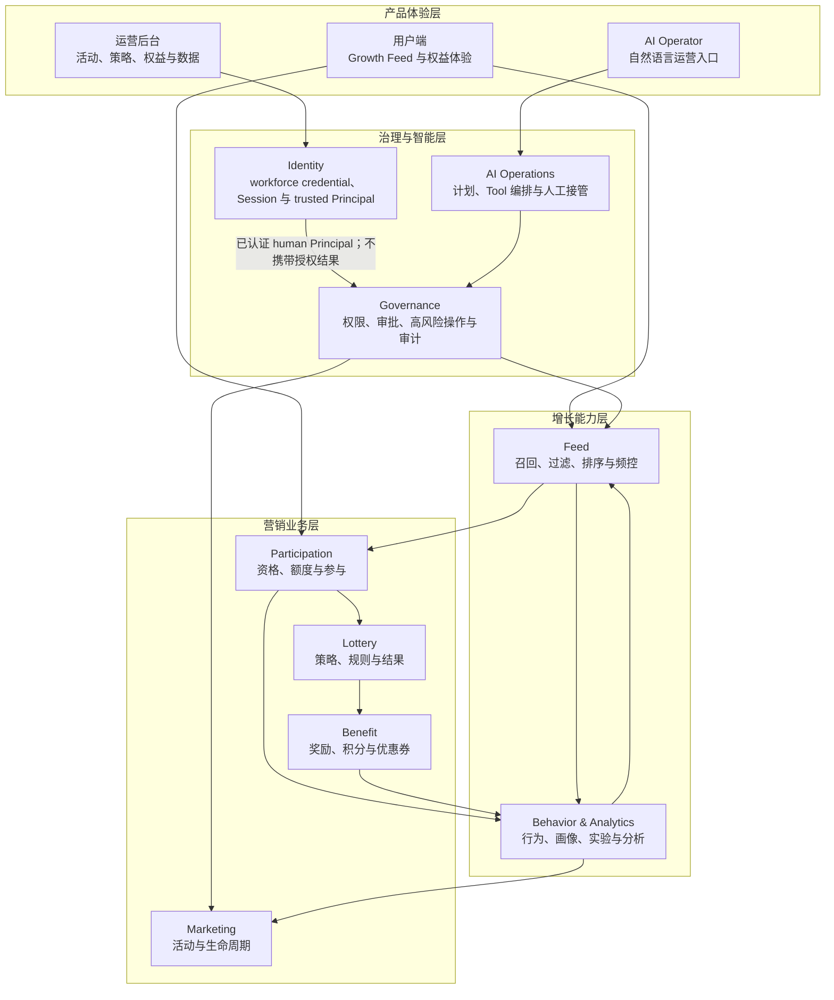
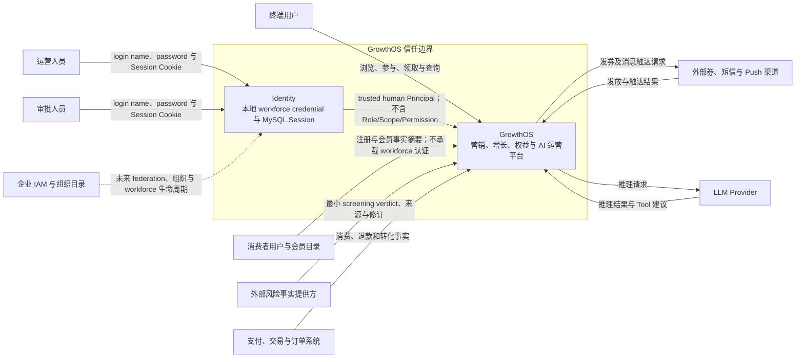
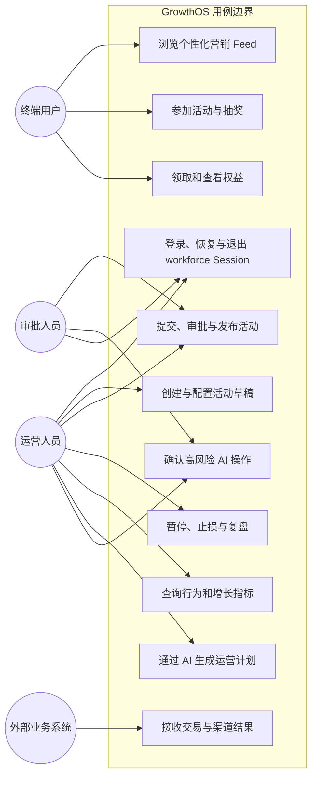
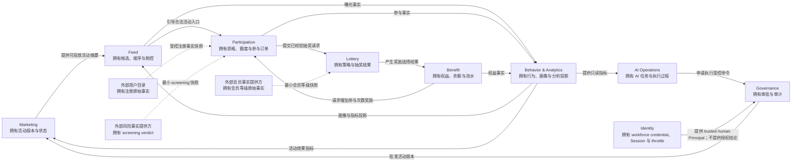
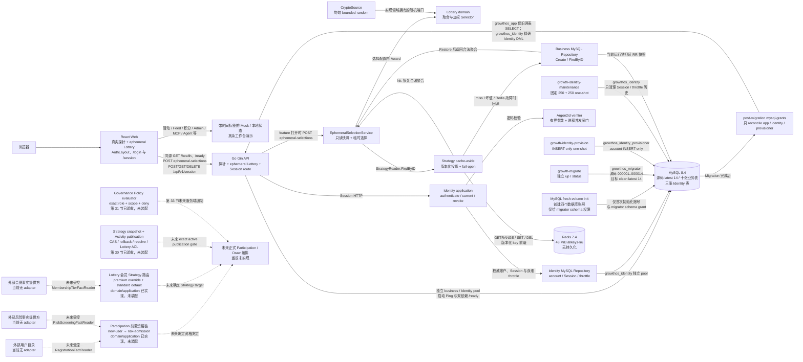

# GrowthOS 系统设计 V0

**状态：** V0 逻辑设计基线；第 32 节真实 Session 认证实现候选正在完成最终验收

**更新日期：** 2026-09-03

**来源章节：** [第 8 节：画 V0 系统设计](../course/part-01/lesson-08-v0-system-design.md)；第 23～29 节持续校准规则/求值边界；第 30 节验收 Strategy snapshot/Activity publication；第 31 节以[访问控制模型基线](access-control-model-threat-boundary-v1.md)与 [ADR-0027](../decisions/ADR-0027-governance-access-control-model.md)验收 Governance 纯 Policy language/evaluator；第 32 节以[真实 Session 认证基线](identity-session-authentication-v1.md)与 [ADR-0028](../decisions/ADR-0028-identity-session-authentication.md)建立 Identity 实现候选和认证停止线。

## 1. 文档目的

本设计把产品定位、用户旅程、运营与 AI 工作流、领域事件、限界上下文和非功能需求放进同一套系统边界中。它回答“GrowthOS 是什么、谁使用、拥有哪些业务能力、依赖哪些外部系统”，不回答最终需要多少微服务、数据库表或中间件。

V0 是后续实现的导航图，不是已完成能力清单。第 11～24 节形成可运行 Gin/React/MySQL/Redis/Compose 基线；第 25～30 节形成未装配的 Participation、Lottery graph/snapshot 与 Marketing Activity publication。第 31 节新增 Governance exact capability、固定 Role ceiling、四种 Scope、immutable Policy revision 与 default-deny evaluator。第 32 节实现候选再新增独立 Identity 上下文、本地 workforce credential、MySQL 权威 Session、三张 Identity 表、独立数据库身份与 pool，以及同源 `/login`、`/session` 消费者；源码 Migration latest 为 14，共十三张应用表。第 32 节只跨越“匿名输入 → trusted human Principal”的认证边界：Policy repository、服务端 RBAC enforcement、业务 Resource fact 装配、前端 capability 裁剪和越权 E2E 仍分别留给第 33～35 节。

## 2. 图例与状态

| 标记 | 含义 |
| --- | --- |
| 实线业务边界 | 已确认需要由 GrowthOS 承担的业务职责 |
| 外部系统 | GrowthOS 只集成，不拥有其主数据和生命周期 |
| 未来能力 | 路线图方向，协议、部署与技术细节尚未锁定 |
| 当前实现 | 仓库里已经存在且可以验证的代码或文档 |

逻辑边界“已确认”不等于运行时代码“已实现”。例如 Benefit 是已识别的业务上下文，但积分和优惠券要到对应章节才建模和建表。

## 3. 产品架构图

这张图按产品职责分层，不表示进程调用顺序。Governance 是人工运营和 AI 运营共用的控制面；AI 不能绕过它直接修改业务事实。

## 4. 系统上下文图

边界含义：

- GrowthOS 拥有活动、参与、抽奖、平台内权益、Feed、行为分析、审批审计和 AI 任务等事实；
- 用户身份、商品、购物车、支付和交易订单不是 V0 核心模型；GrowthOS 消费外部系统确认的交易事实，不能根据点击埋点伪造支付成功；
- 用户目录拥有账户注册原始事实，受控风险提供方拥有 screening verdict；Participation 只能消费最小快照并形成新用户资格、风险准入和组合前置资格决定，不能接管外部生命周期、风险分数、特征或阈值；
- 外部会员 authority 拥有会员等级生命周期与原始事实；Lottery 只能消费最小等级快照并按自己的 policy 形成 Strategy Route，不能升级/降级会员，也不能让外部系统或客户端指定 GrowthOS Strategy target；
- 当前第 32 节由 Identity 自有本地 workforce provider 验证 credential 并恢复 Session；外部企业 IAM/OIDC federation 尚未接入，Identity 也不拥有角色、Scope、Permission 或授权决定；
- 若未来加入自营电商，应作为独立产品范围和上下文重新评审，不直接塞入 Marketing；
- LLM 只生成建议和结构化计划，业务成功必须由 GrowthOS 的确定性模块确认。

## 5. 用例图

### 5.1 V0 用例优先级

| 优先级 | 用例 | 说明 |
| --- | --- | --- |
| 信任入口 | workforce 登录、Session 恢复与退出 | 第 32 节实现候选已建立真实认证入口；认证成功不代表业务授权成功 |
| 核心 | 活动配置、参与、抽奖、权益结果 | 构成营销事实主链路，后续按章节逐步实现 |
| 增长 | Feed、行为、画像、实验与分析 | 建立触达和反馈闭环，核心交易失败时不能靠分析数据修正 |
| 治理 | 权限、审批、审计、暂停与止损 | 人工和 AI 写操作共用，不是后台页面的附属功能 |
| 智能 | AI 计划、Tool 调用和人工接管 | 建立在已稳定的业务 API 之上，最后阶段实现 |

## 6. 领域关系图

箭头只表达业务协作和事实方向。三条虚线表示对外部权威事实的消费方向，不表示已有 adapter、网络协议或在线调用：Participation 拥有场景资格决定而不是注册/风险原始事实，Lottery 拥有会员到 Strategy 的路由决定而不是会员原始事实。第 27 节只完成 Lottery 内核及消费端口，没有把会员 route 接入当前 HTTP 链。Identity 到 Governance 的实线表示第 32 节能形成受信 `VerifiedSession` 与 authentication-layer human `PrincipalID` 证据；第 33 节才把它映射为 `governance.Principal`、加载 Resource/Policy 并进入业务 enforcement。V0 不锁定 HTTP、gRPC、消息队列、数据库 JOIN 或进程边界；这些选择由真实一致性、延迟和部署问题推动。

## 7. 第一版运行形态

当前运行形态仍是模块化单体。业务链仍只装配到旧两表 Strategy 的 ephemeral selection；第 32 节另行装配了一条独立的 Identity 认证链。第 25～30 节新增的资格、路由、graph/evaluator、Strategy snapshot 与 Activity publication 仍只存在于内部源码边界，未进入现有业务 HTTP 链：

宿主开发模式由 Vite 精确代理 <code>/health</code>、<code>/ready</code> 和 <code>/api</code>；Compose 仍只发布 Nginx 回环入口。MySQL fresh-volume init 只在空卷首次启动时创建 `growthos_app`、`growthos_migrator`、`growthos_identity` 和 `growthos_identity_provisioner`，并只给 migrator 执行 schema 前向迁移所需的库级权限。Migration 完成后的 `mysql-grants` 不重写 migrator；它只收敛并核对 app、Identity runtime 和 Identity provisioner 三个运行/一次性身份的精确 allowlist，从而同时支持空卷 bootstrap 和存量卷追加升级。

图中虚线表示未来事实 adapter 或正式编排依赖，不是已存在调用：当前 ephemeral route 仍无主体，绕过 Participation、会员 router、Activity gate 与 Governance Policy。第 32 节 Session route 可以从 credential 恢复 trusted human Principal，但没有把该 Principal 接到业务 handler，也不读取 Role/Scope/Permission。Mock 导航和按钮仍不是权限边界，会员 tier 也不是 Role；Admin、MCP、Agent 与现有业务页面/接口尚未受第 33 节 RBAC 或第 34 节 capability 投影保护。

### 7.1 当前、近期和远期边界

| 时间范围 | 能力 | 状态 |
| --- | --- | --- |
| 当前 | 第 1～31 节已经按台账验收；第 30 节历史 snapshot/Activity/v11 工程证据保持；第 31 节有未装配 Governance evaluator；第 32 节候选的独立 MySQL 与 development HTTP wire 官方门禁已通过，最终全仓/ref 冻结仍在进行 | Session API、独立 Identity pool 和 `/login`、`/session` 已进入候选；第 32 节尚未冻结，也没有受 RBAC 保护的业务 endpoint |
| 第 33～77 节 | 第 33～35 节在真实运营后台前依次建立服务端 RBAC、前端权限裁剪与越权 E2E；随后推进运营后台、活动账户、订单、库存、消息一致性、权益、Feed 与增长反馈闭环 | 尚未实现，不能提前改写完成状态 |
| 第 78～101 节 | 服务拆分、gRPC、Nacos、MCP、Agent、可观测和 Kubernetes | 仅为远期方向 |

这里仅承诺 Redis 承载一个可重建的 Strategy 读取投影，不承诺用户资格、会员路由、抽奖结果或其他业务事实进入缓存，也不承诺 RocketMQ、ClickHouse、OpenSearch 或 Kubernetes 已经部署；Participation 有序资格链与 Lottery 会员 Route 内核的存在也不把 ephemeral route 升级为带认证、幂等、资格/路由门控、库存、发奖和结果查询的正式在线抽奖。会员 router 当前只校验非零 Strategy ID，不证明目标存在、已发布或有业务 version。表内 <code>updated_at</code> 仅是行元数据，不能被解释为聚合版本或精确缓存水位，因此当前只用短 TTL/jitter，尚无写后失效协议。

## 8. 数据与信任边界

### 8.1 数据分类

| 数据类别 | 示例 | V0 原则 |
| --- | --- | --- |
| 核心事实 | 参与订单、抽奖结果、权益流水、审批记录 | 由唯一上下文确认，不能由缓存、分析或模型文字覆盖 |
| 配置 | 活动版本、抽奖策略、Feed 规则、Tool Schema | 允许版本、快照和适度 JSON，具体结构随需求出现 |
| 派生数据 | Redis 缓存、用户画像、搜索索引、分析指标 | 可延迟、可重建，不能成为交易事实源 |
| 外部事实 | 用户注册、会员等级、风险 screening verdict、支付订单、外部券结果 | 保留来源标识、修订和来源时刻，通过防腐层映射；注册/风险事实只供 Participation 形成资格决定，会员 tier 只供 Lottery 形成 Route，不能接管外部生命周期或让外部事实直接冒充 GrowthOS 场景决定 |
| 认证秘密与状态 | password hash envelope、opaque Session token digest、CSRF 派生输入、throttle 摘要与状态 | raw password/token 不落库、不进日志或前端持久层；MySQL 是账户、Session、throttle 唯一 authority，Redis 不是 Session fallback；只向后续授权层输出最小 trusted Principal |

### 8.2 信任原则

- 浏览器、客户端埋点、模型输出和外部回调都属于待验证输入；
- 第 32 节只能通过有效 credential 与 MySQL Session 形成受信 `VerifiedSession` 和 human `PrincipalID`；第 33 节才构造 `governance.Principal`，并由服务端权威加载 tenant/owner/object facts 与 Policy；
- 所有写操作由服务端校验身份、业务状态、幂等标识和资源范围；
- 高风险人工与 AI 操作都经过 Governance，审批和执行参数绑定；
- 秘密不进入前端包、日志、Prompt、仓库和行为事件；
- 跨上下文复制的数据是只读摘要、快照或投影，必须说明权威来源。

## 9. NFR 如何约束 V0

| 质量目标 | V0 架构约束 |
| --- | --- |
| 正确性 | 核心事实有唯一所有者，不能由页面、分析表或 AI 宣布成功 |
| 幂等 | 参与、抽奖、发放和高风险 Tool 将使用业务请求标识与结果查询语义 |
| 可用性 | Feed/分析/AI 可降级，权限、库存和权益不变量不能跳过 |
| 可扩展性 | 先模块化单体，边界清晰但不提前承担分布式复杂度 |
| 可追踪 | 后续 HTTP、RPC、消息、Tool 和任务统一传播关联标识 |
| 恢复 | 核心事实、配置和可重建投影采用不同 RPO/RTO，不把缓存当备份 |
| 安全审计 | 外部输入默认不可信，高风险动作需要权限、审批和不可覆盖的审计 |

具体目标值和验证里程碑以[非功能需求基线 v1](non-functional-requirements-v1.md)为准。

## 10. V0 明确不做

- 不预先给出最终 ER 图、最终表清单、最终 Migration 编号或分库分表方案；当前列出的 `000001`～`000014` 只是已经发生的 inventory，不是终态预制；
- 不把限界上下文等同于微服务、Go package 或独立数据库；
- 不引入自营商品、购物车、支付和交易订单模型；
- 不确定同步调用、RPC、MQ 或事件主题；
- 不根据远期峰值提前部署全套基础设施；
- 不声称 Mock 前端代表真实业务闭环已经完成。

## 11. 演进和漂移规则

1. 每次新增业务能力先指出现有设计不足，再调整上下文、数据或运行形态；
2. 系统边界或事实所有权变化时同步本文件、限界上下文地图、课程正文和 QA；
3. API、事件或数据契约出现时登记对应章节台账；
4. 形成长期且跨章节的技术决策时新增 ADR；
5. 第 101 节只依据实际代码、Migration 和部署资产重画最终架构与 ER 图。

## 12. 下一阶段输入

第 11～30 节依次形成运行基线、ephemeral Lottery、资格/路由、exact graph/snapshot 和 Activity publication。第 31 节建立公共 Principal/Resource/Action/Role/Scope/Policy 语言与纯 default-deny evaluator；第 32 节实现候选建立本地 workforce credential、MySQL 权威 Session 与 trusted human Principal，并提供同源 Session API 和认证页面。待最终验收冻结后，第 33～35 节再依次建立服务端强制、前端权限感知和越权端到端验收。当前不能用登录成功、隐藏菜单、会员 tier、构造出的 Principal、Route 或 publication resolve 成功代替授权。

继续遵守 V0 的真实状态表达：历史 v11 工程验收不等于 runtime 或 SLO，publication resolve 不等于 Draw/授权/审批，Policy allow 不等于 caller 已认证或 handler 已强制，Session 成功也不等于业务请求已授权。第 32 节实现候选的证据入口见[产品基线](identity-session-authentication-v1.md)、[课程](../course/part-04/lesson-32-real-session-authentication.md)、[API](../api/lessons/lesson-32.md)、[QA](../qa/lessons/lesson-32.md)、[设计手记](../design-thinking/lessons/lesson-32.md)、[面试问答](../interview/lessons/lesson-32.md)、[运维手册](../runbooks/identity-session-operations.md)和 [ADR-0028](../decisions/ADR-0028-identity-session-authentication.md)。独立 MySQL 与 development HTTP wire 的官方门禁已通过；最终全仓门禁、远程 ref 对齐与冻结 tip 完成前，本文件仍不把第 32 节登记为已验收。
