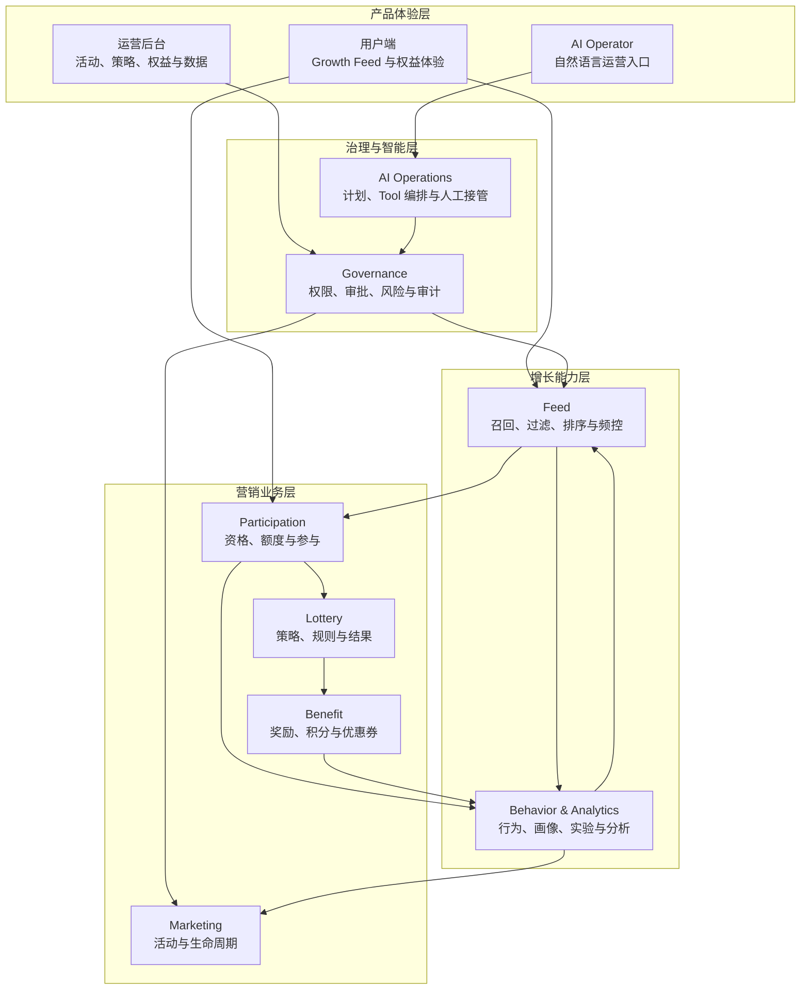
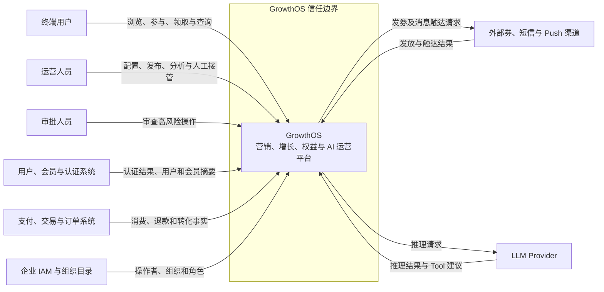
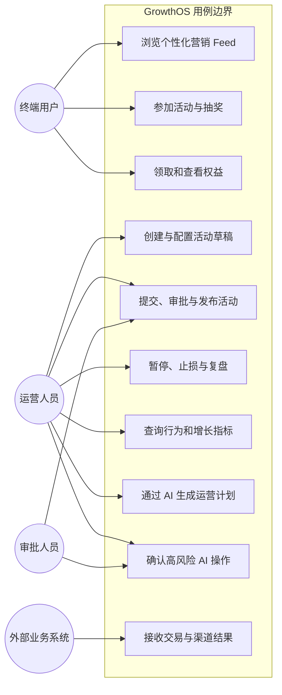
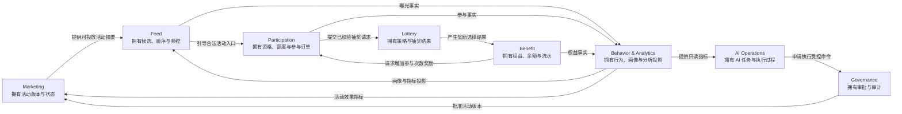
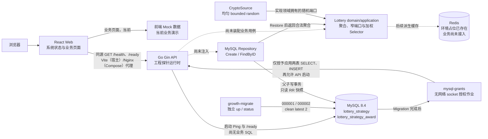

# GrowthOS 系统设计 V0

**状态：** V0 逻辑设计基线

**更新日期：** 2026-08-29

**来源章节：** [第 8 节：画 V0 系统设计](../course/part-01/lesson-08-v0-system-design.md)

## 1. 文档目的

本设计把产品定位、用户旅程、运营与 AI 工作流、领域事件、限界上下文和非功能需求放进同一套系统边界中。它回答“GrowthOS 是什么、谁使用、拥有哪些业务能力、依赖哪些外部系统”，不回答最终需要多少微服务、数据库表或中间件。

V0 是后续实现的导航图，不是已完成能力清单。当前仓库已有文档工具、第 14 节 React 前端框架、第 11～16 节已验收的 Gin 进程、`GET /health`、`GET /ready`、类型化配置、结构化日志、请求关联、统一错误、MySQL 连接池、独立 Migration 命令、系统状态页同源联调和 Compose M0 开发栈，第 17～18 节的 Lottery Strategy/Award 领域对象与两张业务表，第 19 节 Create/FindByID 窄仓储、聚合写事务、只读 RR 快照和精确两表 `SELECT, INSERT` 权限，以及第 20 节完整 `uint64` 边界的加权 Selector 与 `crypto/rand` adapter。除系统探针外的前端业务页面仍使用 Mock；Repository 与 Selector 尚未装配进产品进程，业务 API、Draw/Result、Redis 业务调用、MQ、MCP Gateway 与 AI Agent 运行时仍未实现。

## 2. 图例与状态

| 标记 | 含义 |
| --- | --- |
| 实线业务边界 | 已确认需要由 GrowthOS 承担的业务职责 |
| 外部系统 | GrowthOS 只集成，不拥有其主数据和生命周期 |
| 未来能力 | 路线图方向，协议、部署与技术细节尚未锁定 |
| 当前实现 | 仓库里已经存在且可以验证的代码或文档 |

逻辑边界“已确认”不等于运行时代码“已实现”。例如 Benefit 是已识别的业务上下文，但积分和优惠券要到对应章节才建模和建表。

## 3. 产品架构图

这张图按产品职责分层，不表示进程调用顺序。Governance 是人工运营和 AI 运营共用的控制面；AI 不能绕过它直接修改业务事实。

## 4. 系统上下文图

边界含义：

- GrowthOS 拥有活动、参与、抽奖、平台内权益、Feed、行为分析、审批审计和 AI 任务等事实；
- 用户身份、商品、购物车、支付和交易订单不是 V0 核心模型；GrowthOS 消费外部系统确认的交易事实，不能根据点击埋点伪造支付成功；
- 若未来加入自营电商，应作为独立产品范围和上下文重新评审，不直接塞入 Marketing；
- LLM 只生成建议和结构化计划，业务成功必须由 GrowthOS 的确定性模块确认。

## 5. 用例图

### 5.1 V0 用例优先级

| 优先级 | 用例 | 说明 |
| --- | --- | --- |
| 核心 | 活动配置、参与、抽奖、权益结果 | 构成营销事实主链路，后续按章节逐步实现 |
| 增长 | Feed、行为、画像、实验与分析 | 建立触达和反馈闭环，核心交易失败时不能靠分析数据修正 |
| 治理 | 权限、审批、审计、暂停与止损 | 人工和 AI 写操作共用，不是后台页面的附属功能 |
| 智能 | AI 计划、Tool 调用和人工接管 | 建立在已稳定的业务 API 之上，最后阶段实现 |

## 6. 领域关系图

箭头只表达业务协作和事实方向。V0 不锁定 HTTP、gRPC、消息队列、数据库 JOIN 或进程边界；这些选择由真实一致性、延迟和部署问题推动。

## 7. 第一版运行形态

第 9～20 节的当前形态是一个模块化单体，而不是上图中每个方框一个服务；领域、表、仓储和选择器代码已经存在，但尚未装配成 HTTP 业务运行链路：

宿主开发模式由 Vite 精确代理 `/health`、`/ready` 和预留的 `/api` 路径边界；Compose 模式则由只发布 `127.0.0.1:8088` 的 Nginx 提供相同同源路径，API、MySQL 和 Redis 不发布宿主机端口。Compose 启动链是 `mysql → migrate → mysql-grants → api`；授权作业 `network_mode: none`，只经 Unix socket 运行，并在 grants 不是精确 allowlist 或 `@@GLOBAL.mandatory_roles` 非空时失败关闭。当前浏览器到 API 的实线只代表两个系统探针已经真实接通；Lottery Repository 已在单元、真实 MySQL 与 Compose 权限层验证，Selector/CryptoSource 已在纯内存、错误注入、边界、并发和微基准层验证，但 `growth-api` 尚未构造或调用它们，`/api` 尚无业务接口，Redis 也没有 API client 或业务数据，Mock 节点不属于服务端事实源。

### 7.1 当前、近期和远期边界

| 时间范围 | 能力 | 状态 |
| --- | --- | --- |
| 当前 | 中文产品文档、课程/QA/API 台账、文档漂移检查、React UI 框架与业务 Mock；第 11～16 节 Gin、配置、错误、MySQL、Migration、系统探针同源联调和 Compose M0 已验收；第 17～20 节 Strategy/Award 领域、两表 Schema/latest 2、Create/FindByID Repository、精确 SELECT/INSERT 授权、WeightedSelector 与 CryptoSource 已验收 | 已存在的能力按台账和 QA 核查 |
| 第 21～72 节 | Lottery API/页面/规则/缓存、活动、账户、库存、MQ、权益、Feed、行为与分析 | 随需求演进 |
| 第 73～96 节 | 服务拆分、gRPC、Nacos、MCP、Agent、可观测和 Kubernetes | 仅为远期方向 |

这里不承诺 Redis 已经承载业务缓存，也不承诺 RocketMQ、ClickHouse、OpenSearch 或 Kubernetes 已经部署；Compose 的隔离 Redis 占位不等于业务接入，Strategy/Award 领域、两张表、Repository 和 Selector 也不等于可在线抽奖或已经形成最终结果事实。表内 `updated_at` 仅是行元数据，不能被解释为聚合版本或缓存水位。

## 8. 数据与信任边界

### 8.1 数据分类

| 数据类别 | 示例 | V0 原则 |
| --- | --- | --- |
| 核心事实 | 参与订单、抽奖结果、权益流水、审批记录 | 由唯一上下文确认，不能由缓存、分析或模型文字覆盖 |
| 配置 | 活动版本、抽奖策略、Feed 规则、Tool Schema | 允许版本、快照和适度 JSON，具体结构随需求出现 |
| 派生数据 | Redis 缓存、用户画像、搜索索引、分析指标 | 可延迟、可重建，不能成为交易事实源 |
| 外部事实 | 用户身份、支付订单、外部券结果 | 保留来源标识和时间，通过防腐层映射，不接管外部生命周期 |

### 8.2 信任原则

- 浏览器、客户端埋点、模型输出和外部回调都属于待验证输入；
- 所有写操作由服务端校验身份、业务状态、幂等标识和资源范围；
- 高风险人工与 AI 操作都经过 Governance，审批和执行参数绑定；
- 秘密不进入前端包、日志、Prompt、仓库和行为事件；
- 跨上下文复制的数据是只读摘要、快照或投影，必须说明权威来源。

## 9. NFR 如何约束 V0

| 质量目标 | V0 架构约束 |
| --- | --- |
| 正确性 | 核心事实有唯一所有者，不能由页面、分析表或 AI 宣布成功 |
| 幂等 | 参与、抽奖、发放和高风险 Tool 将使用业务请求标识与结果查询语义 |
| 可用性 | Feed/分析/AI 可降级，权限、库存和权益不变量不能跳过 |
| 可扩展性 | 先模块化单体，边界清晰但不提前承担分布式复杂度 |
| 可追踪 | 后续 HTTP、RPC、消息、Tool 和任务统一传播关联标识 |
| 恢复 | 核心事实、配置和可重建投影采用不同 RPO/RTO，不把缓存当备份 |
| 安全审计 | 外部输入默认不可信，高风险动作需要权限、审批和不可覆盖的审计 |

具体目标值和验证里程碑以[非功能需求基线 v1](non-functional-requirements-v1.md)为准。

## 10. V0 明确不做

- 不给出最终 ER 图、表清单、Migration 编号或分库分表方案；
- 不把限界上下文等同于微服务、Go package 或独立数据库；
- 不引入自营商品、购物车、支付和交易订单模型；
- 不确定同步调用、RPC、MQ 或事件主题；
- 不根据远期峰值提前部署全套基础设施；
- 不声称 Mock 前端代表真实业务闭环已经完成。

## 11. 演进和漂移规则

1. 每次新增业务能力先指出现有设计不足，再调整上下文、数据或运行形态；
2. 系统边界或事实所有权变化时同步本文件、限界上下文地图、课程正文和 QA；
3. API、事件或数据契约出现时登记对应章节台账；
4. 形成长期且跨章节的技术决策时新增 ADR；
5. 第 96 节只依据实际代码、Migration 和部署资产重画最终架构与 ER 图。

## 12. 下一阶段输入

第 11～16 节已经形成当前 Go 运行时、数据库基础设施、React 框架、首个系统探针联调切片和 Compose M0 开发环境；第 17～18 节建立 Lottery 聚合与两张业务表；第 19 节用 Create/FindByID 窄端口、原子写事务、只读 RR 快照和领域恢复闭合仓储边界；第 20 节再以 bounded random port、`crypto/rand.Int` 和减法桶闭合最小加权选择机制。下一步第 21 节开放首个 Lottery API 时，必须先解决 composition root 如何共享数据库池与 adapter，并避免把无 DrawID、结果持久化和幂等语义的瞬时选择伪装为可安全重试的最终抽奖。继续遵守 V0 的真实状态表达：Repository/Selector 存在不等于在线业务，行时间戳不等于聚合版本，环境中的 Redis 占位不等于业务缓存，未来服务和基础设施不能提前伪装成交付物。
